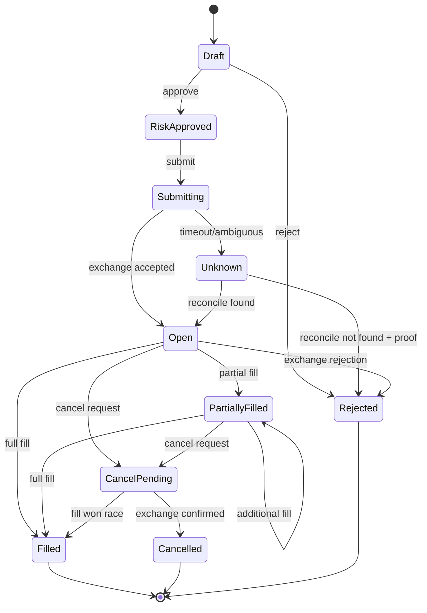

# Domain Modeli

**Durum:** Taslak

## 1. Ubiquitous Language

| Terim | Tanım |
|---|---|
| Instrument | İşlem yapılan sembol ve borsa filtreleri |
| Candle | Belirli zaman aralığındaki OHLCV verisi |
| Signal | Stratejinin piyasa yorumu; emir değildir |
| Trade Intent | Stratejinin yön, miktar ve gerekçeli işlem niyeti |
| Risk Decision | Intent için approve, resize veya reject sonucu |
| Order | Borsaya gönderilen işlem talebi |
| Execution/Fill | Emrin gerçekleşen parçası |
| Position | Bir instrument üzerindeki net/hedged exposure |
| Reconciliation | Yerel durumun borsa gerçeğiyle karşılaştırılıp düzeltilmesi |
| Kill Switch | Yeni riski engelleyen acil durum kontrolü |

## 2. Bounded context’ler

### Market Data Context

- `Instrument` aggregate: tick size, lot size, min/max notional, status.
- `Candle`, `TradeTick`, `OrderBookSnapshot` immutable value data.
- Sequence ve timestamp doğrulama.

### Strategy Context

- `StrategyInstance` aggregate: parametre sürümü, çalışma durumu ve son işlenen bar.
- Çıktı `TradeIntent`; doğrudan `Order` üretemez.
- Aynı girdi ve sürüm aynı sonucu üretmelidir.

### Risk Context

- `RiskProfile` aggregate: işlem, sembol, portföy ve günlük kayıp limitleri.
- `RiskDecision`: Approved, Resized, Rejected.
- Kill switch ve stale-data kontrolü her karardan önce uygulanır.

### Execution Context

- `Order` aggregate: state machine ve fill toplamı.
- `Execution` entity/value data.
- Client order ID idempotency anahtarıdır.

### Portfolio Context

- `Portfolio` aggregate/projection: balance, position, realized/unrealized PnL ve exposure.
- Borsa snapshot’ları ile reconcile edilir.

## 3. Temel value object’ler

- `Money(amount, currency)`
- `Price(value, instrument)`
- `Quantity(value, instrument)`
- `Percentage(value)`
- `InstrumentId(exchange, symbol)`
- `ClientOrderId(botPrefix, strategyId, uniqueValue)`
- `Timeframe(duration)`
- `Fee(amount, asset)`

Value object’ler construction sırasında geçerliliğini doğrular ve sonradan değişmez.

## 4. Order state machine

## 5. Kritik invariants

- Price ve quantity pozitiftir ve borsa adımlarına normalize edilmiştir.
- Notional, instrument min/max kurallarına uyar.
- Risk onayı olmadan `Submitting` durumuna geçilemez.
- Aynı `ClientOrderId` ikinci ekonomik işlem oluşturamaz.
- Filled quantity, order quantity değerini aşamaz.
- Terminal emir durumu terminal olmayan duruma dönemez.
- Stale veya gap içeren market data yeni intent üretemez.
- Stop mesafesi ve position size birlikte maksimum kayıp limitini aşamaz.
- Live modda account status, position mode ve margin mode doğrulanmadan emir açılamaz.
- Günlük kayıp limiti veya kill switch aktifken yeni exposure yasaktır.

## 6. Domain event’ler

- `MarketDataGapDetected`
- `TradeIntentCreated`
- `RiskDecisionMade`
- `OrderSubmissionRequested`
- `OrderAccepted`
- `OrderPartiallyFilled`
- `OrderFilled`
- `OrderCancelled`
- `OrderOutcomeBecameUnknown`
- `PositionChanged`
- `RiskLimitBreached`
- `KillSwitchActivated`
- `ExternalInterventionDetected`

Event’ler geçmiş zamanla adlandırılır ve UTC occurrence time, aggregate ID, correlation ID ve schema version taşır.
