# Sistem Diyagramları

**Durum:** Taslak

## 1. Sistem bağlamı

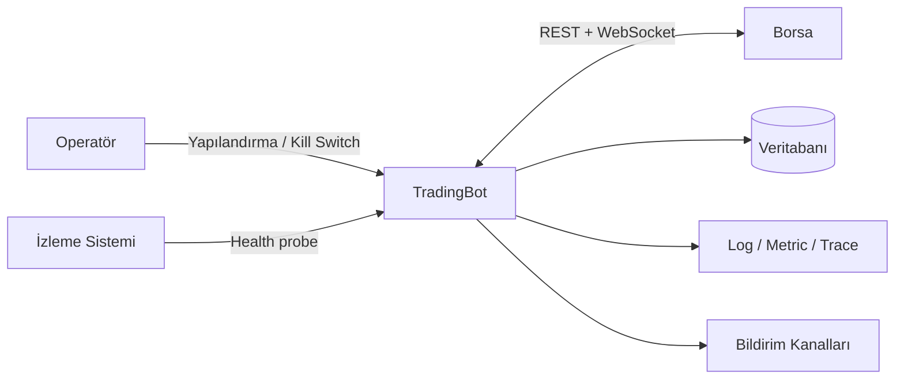

## 2. Container/bileşen görünümü

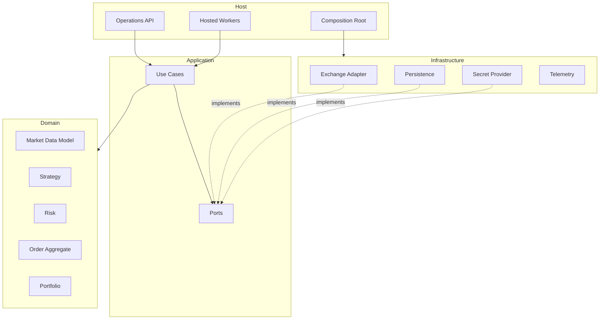

## 3. Market data akışı

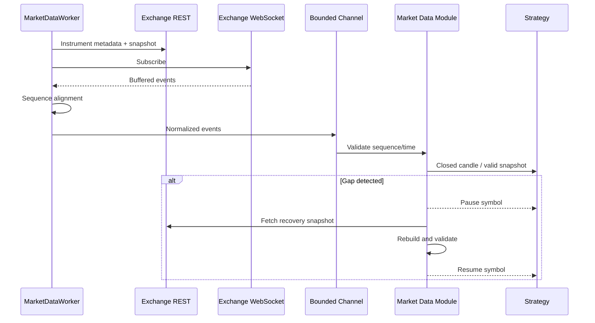

## 4. Emir yaşam döngüsü

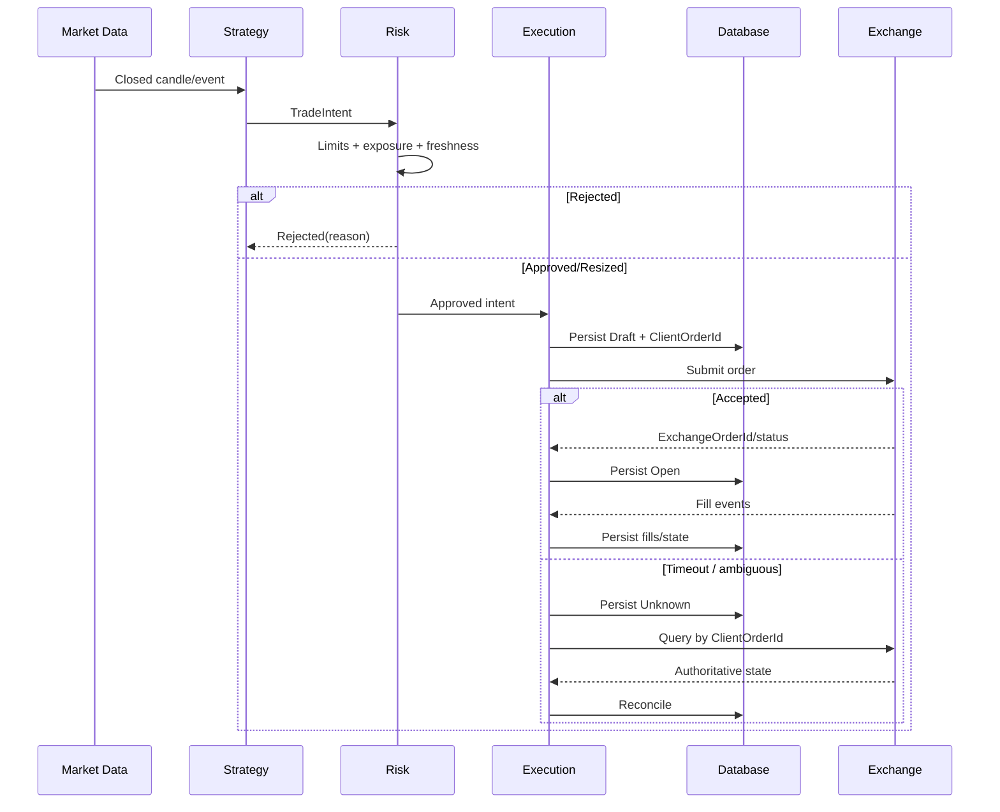

## 5. Deployment

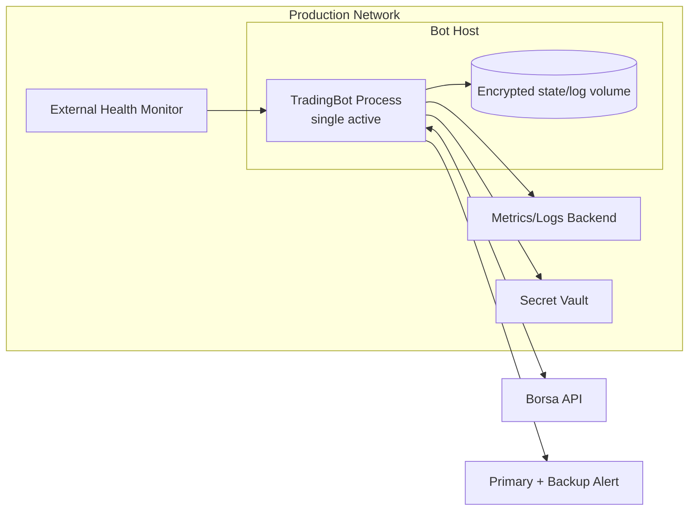

## 6. ACID ve dış borsa sınırı

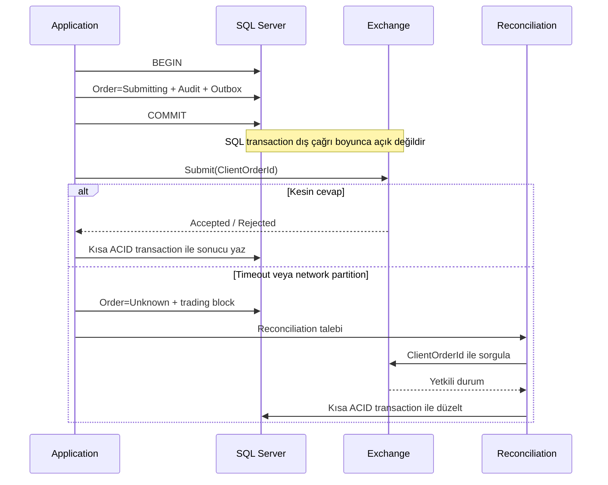

## 7. Tutarlılık bölgeleri

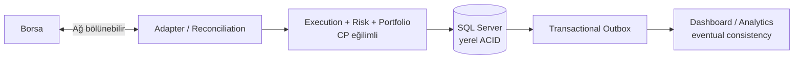

## 8. Bağımlılık yönü

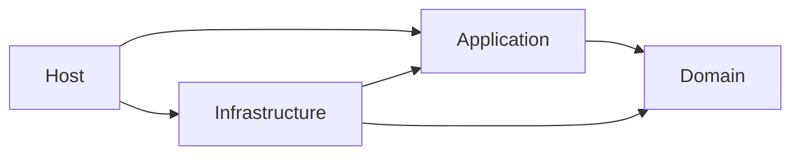

Okların hiçbiri dış katmandan içeri doğru ters çevrilemez; Domain bağımsız kalır.

## 9. Tam gerçekleşen Spot fill persistence akışı

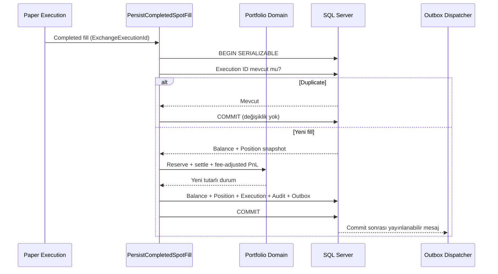

Bu kısa yol tamamen gerçekleşen paper fill içindir. Açık ve parçalı emirler aşağıdaki kalıcı rezervasyon yaşam döngüsünü kullanır.

## 10. Partial fill ve kalıcı rezervasyon yaşam döngüsü

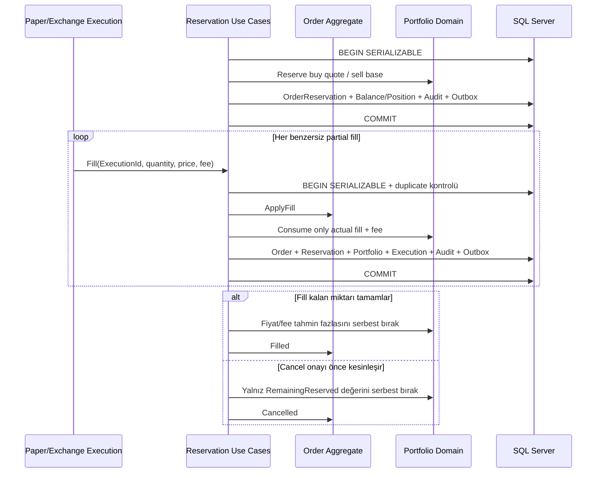

Serializable transaction ve `rowversion`, aynı order üzerindeki fill/cancel yarışında lost update'i engeller. Terminal reservation'a gelen geç olay bakiye veya PnL oluşturamaz.

## 11. Spot account reconciliation ve trading halt

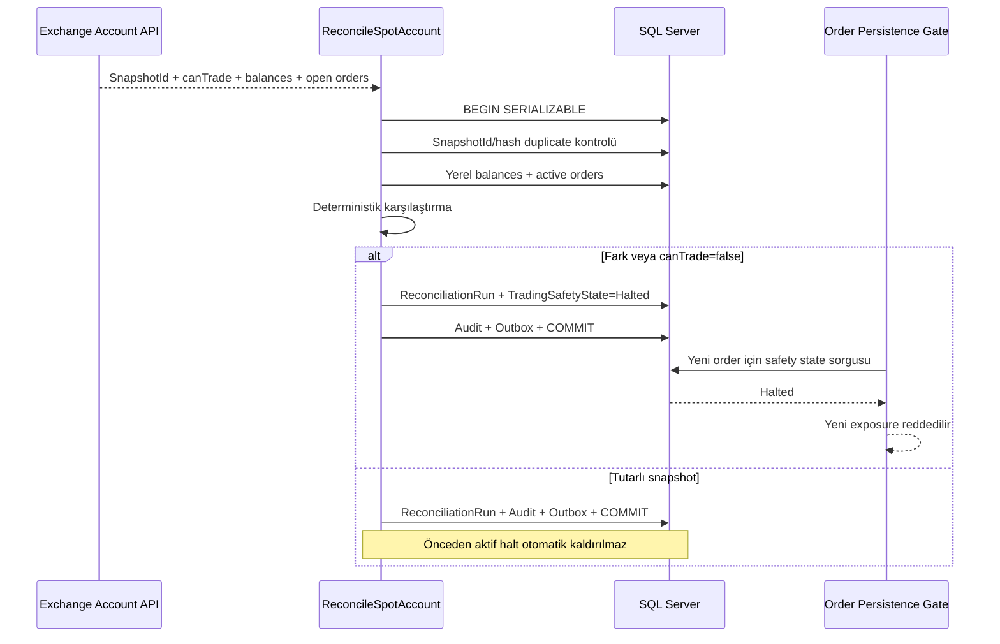

## 12. Kontrollü trading safety recovery

```mermaid
sequenceDiagram
    participant OP as Yetkili Operatör
    participant REC as Reconciliation
    participant SAFE as RecoverTradingSafety
    participant DB as SQL Server
    participant ORD as Order Persistence Gate

    REC->>DB: Clean snapshot #1 (halt sonrasında)
    REC->>DB: Clean snapshot #2 (halt sonrasında)
    OP->>SAFE: RecoveryId + OperatorId + Reason
    SAFE->>DB: BEGIN SERIALIZABLE
    SAFE->>DB: Halt state + son 2 run + duplicate RecoveryId
    alt Kanıt eksik veya snapshot kirli
        SAFE-->>OP: Recovery reddedildi
    else İki snapshot tutarlı ve canTrade=true
        SAFE->>DB: SafetyState=Ready + Recovery + Audit + Outbox
        SAFE->>DB: COMMIT
        ORD->>DB: Yeni risk onayının zamanı safety transition'dan sonra mı?
        alt Eski risk onayı
            ORD-->>ORD: Reddet; yeniden risk değerlendirmesi gerekli
        else Yeni risk onayı
            ORD->>DB: Atomik order persistence
        end
    end
```

## 13. Deterministik paper execution

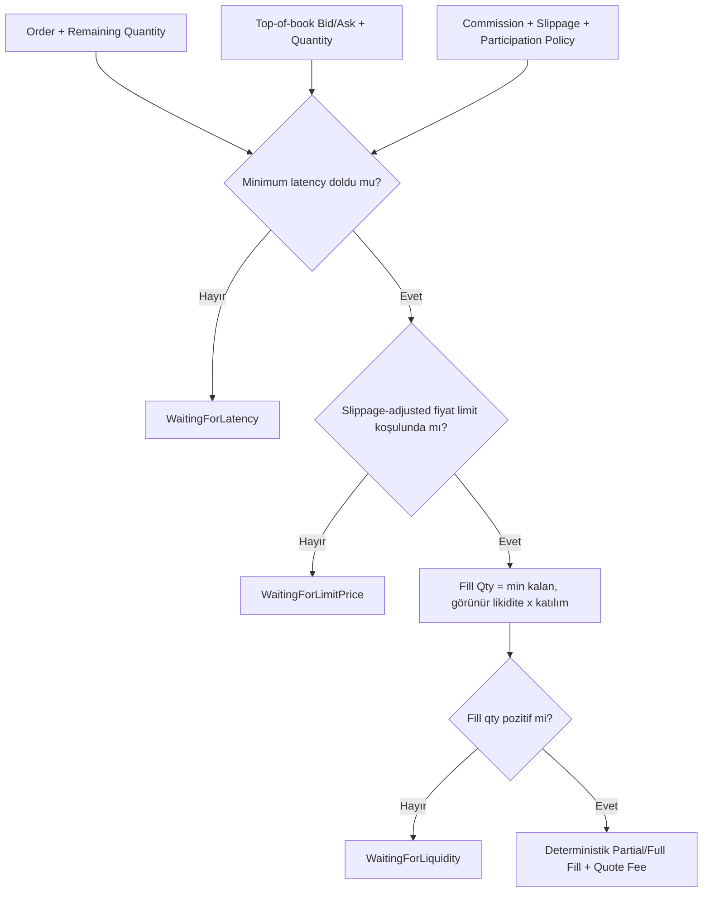
