# Sistem Diyagramları

**Durum:** Taslak

## 1. Sistem bağlamı

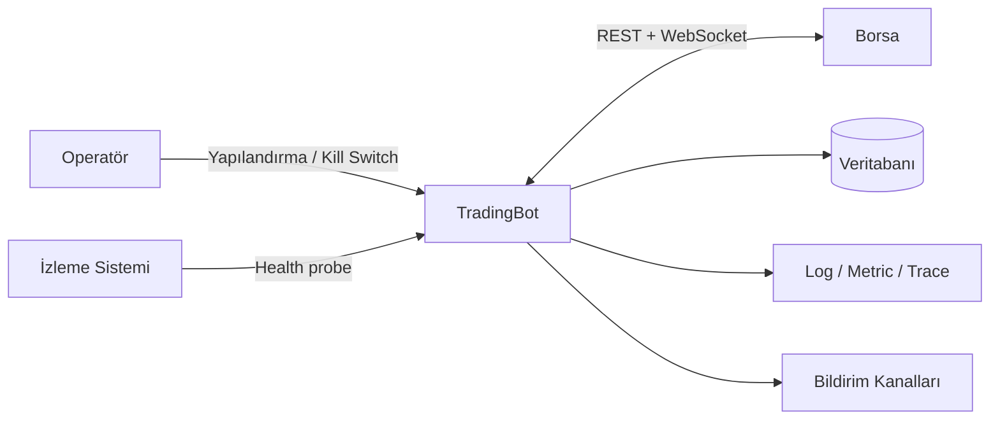

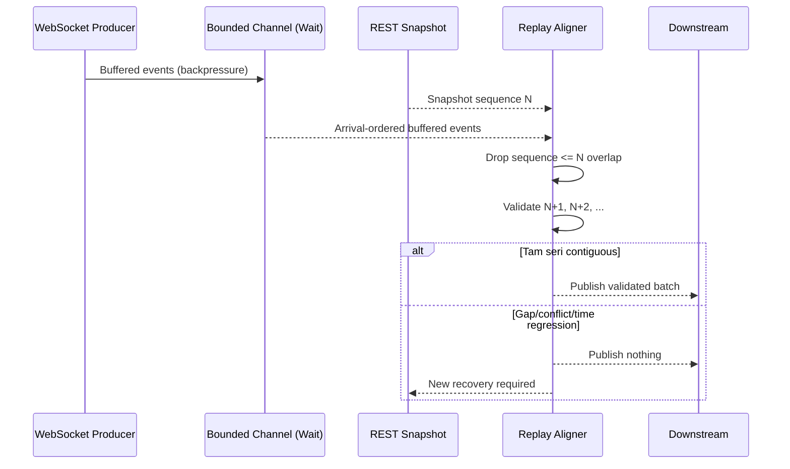

## 2. Container/bileşen görünümü

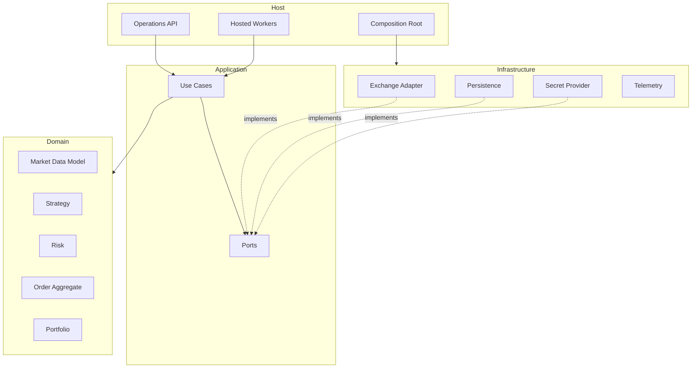

## 3. Market data akışı

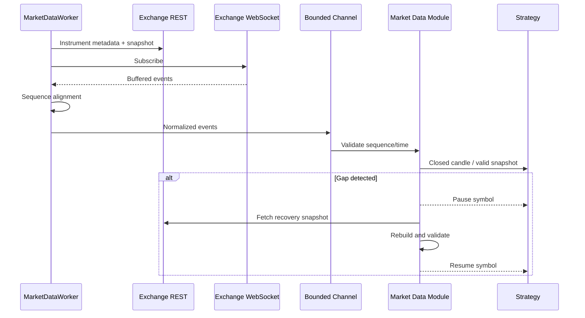

### Market-data integrity state machine

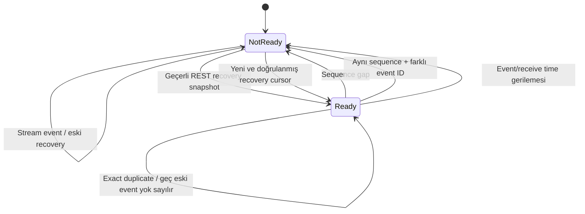

Guard son güvenilir cursor'u gap sırasında ilerletmez. Bu sayede recovery adapter'ı hangi sequence'den itibaren snapshot/replay gerektiğini kesin olarak bilir.

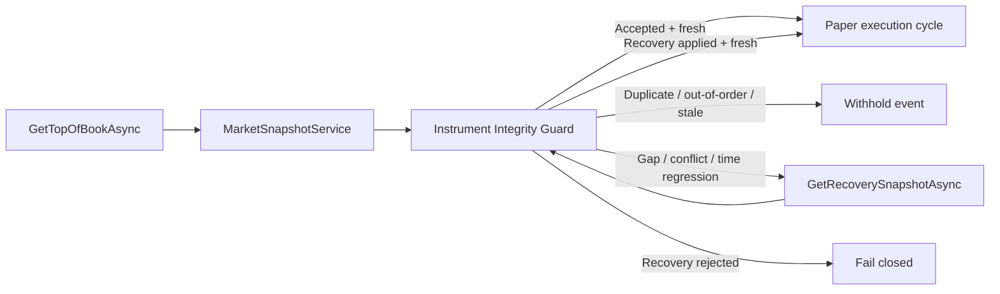

## 4. Emir yaşam döngüsü

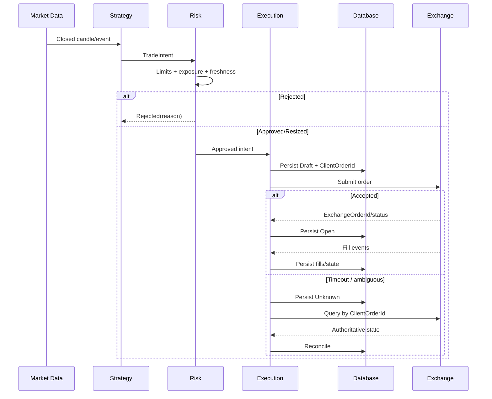

## 5. Deployment

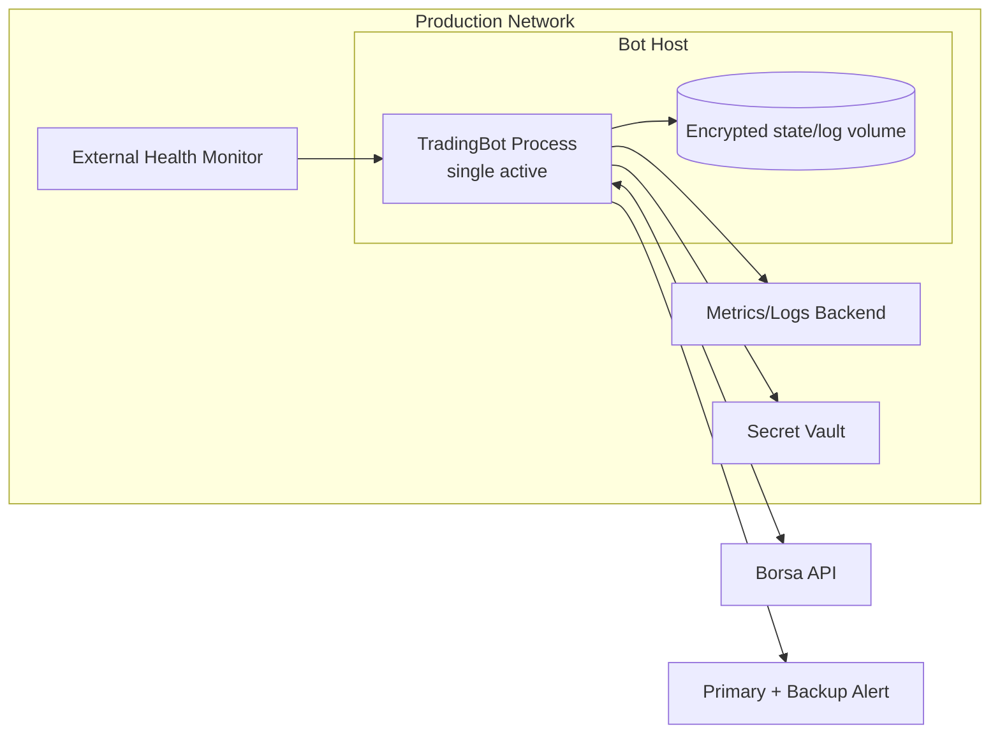

## 6. ACID ve dış borsa sınırı

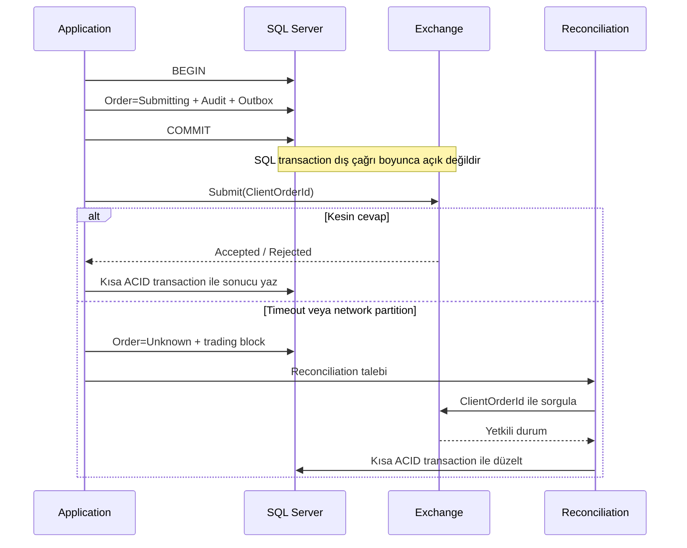

## 7. Tutarlılık bölgeleri

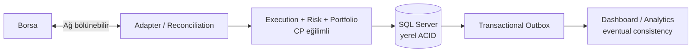

## 8. Bağımlılık yönü

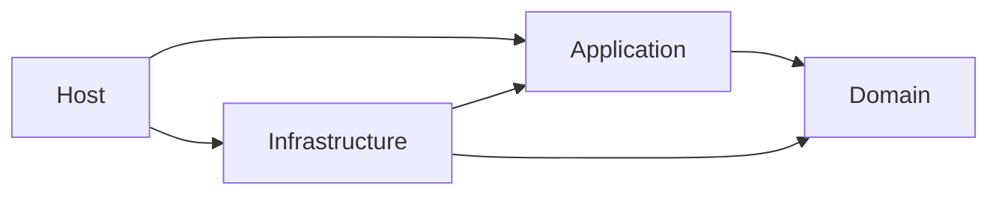

Okların hiçbiri dış katmandan içeri doğru ters çevrilemez; Domain bağımsız kalır.

## 9. Tam gerçekleşen Spot fill persistence akışı

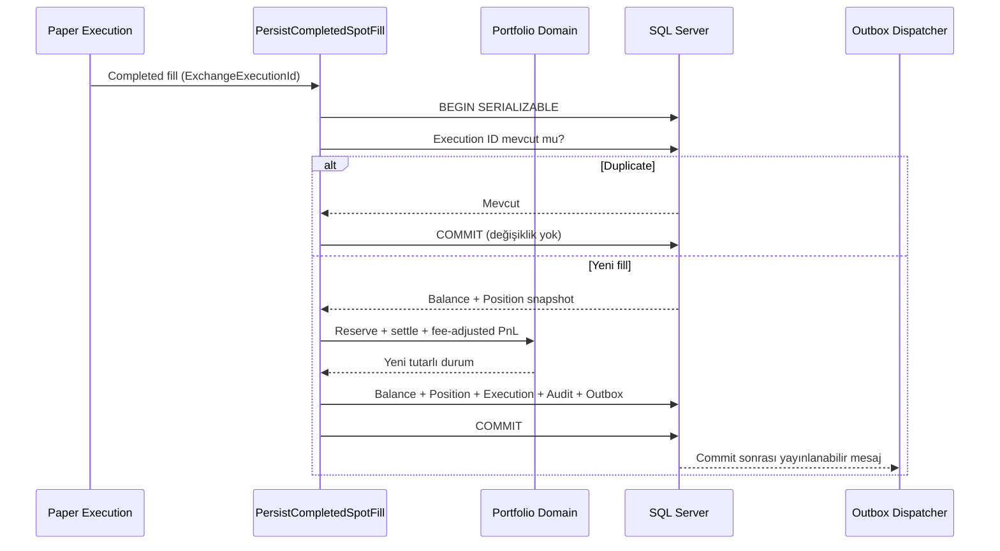

Bu kısa yol tamamen gerçekleşen paper fill içindir. Açık ve parçalı emirler aşağıdaki kalıcı rezervasyon yaşam döngüsünü kullanır.

## 10. Partial fill ve kalıcı rezervasyon yaşam döngüsü

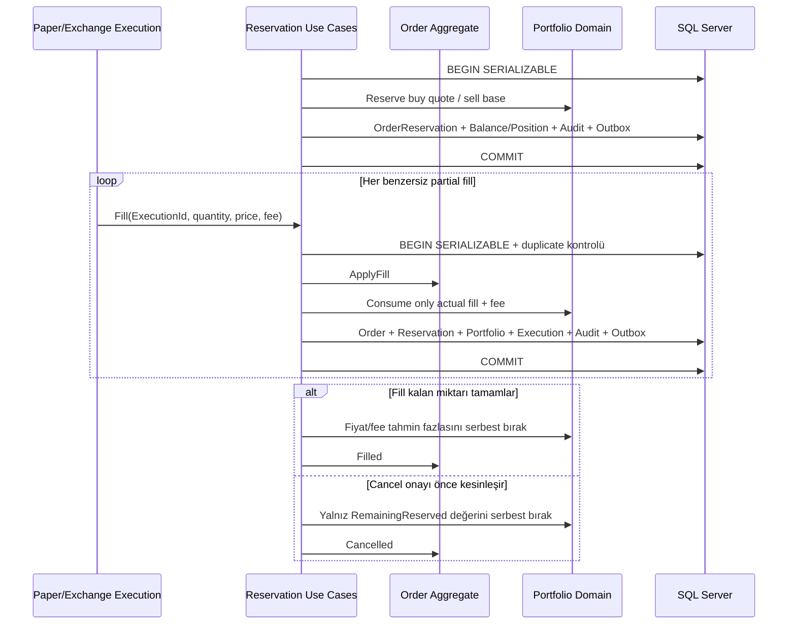

Serializable transaction ve `rowversion`, aynı order üzerindeki fill/cancel yarışında lost update'i engeller. Terminal reservation'a gelen geç olay bakiye veya PnL oluşturamaz.

## 11. Spot account reconciliation ve trading halt

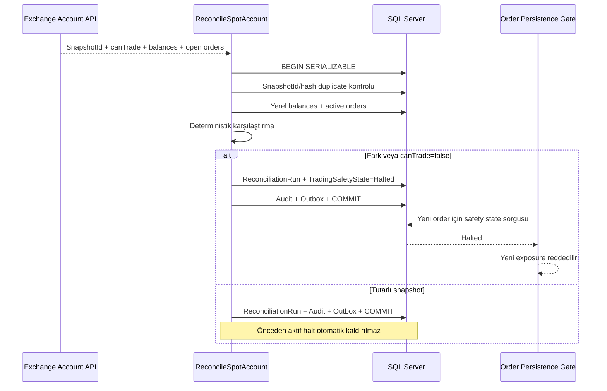

## 12. Kontrollü trading safety recovery

```mermaid
sequenceDiagram
    participant OP as Yetkili Operatör
    participant REC as Reconciliation
    participant SAFE as RecoverTradingSafety
    participant DB as SQL Server
    participant ORD as Order Persistence Gate

    REC->>DB: Clean snapshot #1 (halt sonrasında)
    REC->>DB: Clean snapshot #2 (halt sonrasında)
    OP->>SAFE: RecoveryId + OperatorId + Reason
    SAFE->>DB: BEGIN SERIALIZABLE
    SAFE->>DB: Halt state + son 2 run + duplicate RecoveryId
    alt Kanıt eksik veya snapshot kirli
        SAFE-->>OP: Recovery reddedildi
    else İki snapshot tutarlı ve canTrade=true
        SAFE->>DB: SafetyState=Ready + Recovery + Audit + Outbox
        SAFE->>DB: COMMIT
        ORD->>DB: Yeni risk onayının zamanı safety transition'dan sonra mı?
        alt Eski risk onayı
            ORD-->>ORD: Reddet; yeniden risk değerlendirmesi gerekli
        else Yeni risk onayı
            ORD->>DB: Atomik order persistence
        end
    end
```

## 13. Deterministik paper execution

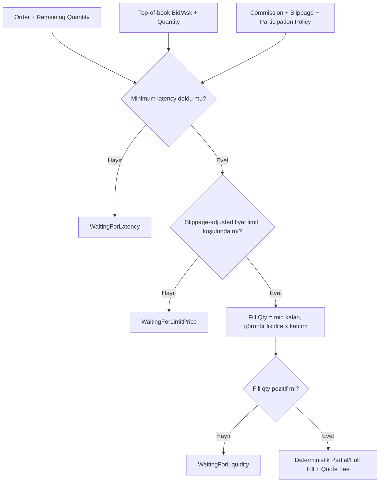

## 14. Uçtan uca paper fill persistence pipeline

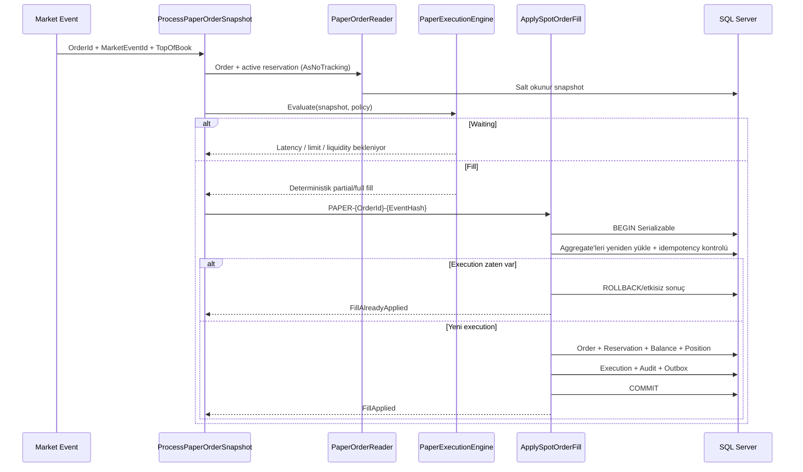

## 15. Hosted paper market-event döngüsü

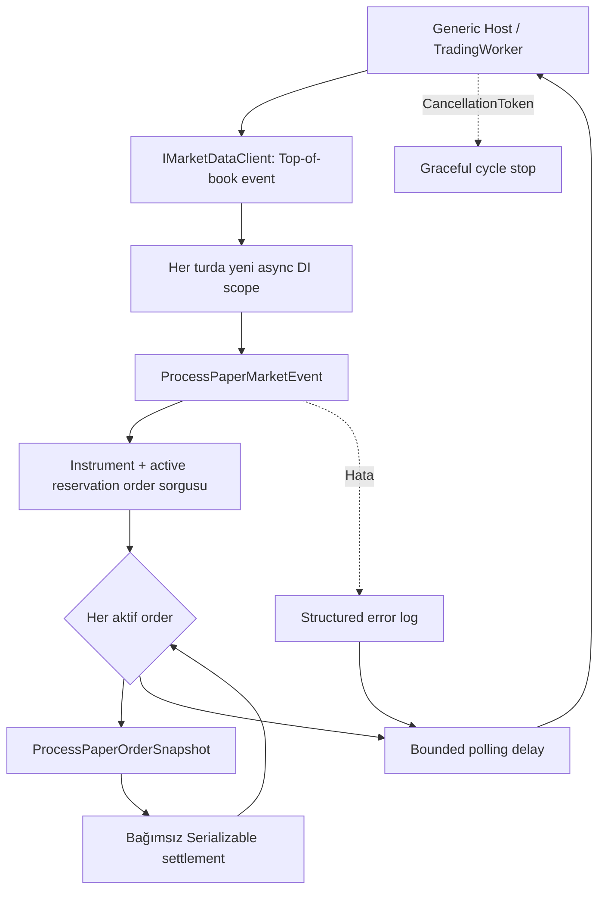

Worker singleton olsa da scoped persistence nesnesi taşımaz. Market event fan-out sıralıdır; bu ilk sürümde aynı order üzerinde paralel settlement yarışı üretilmez.

## 16. OKX public books5 WebSocket taşıması

```mermaid
sequenceDiagram
    participant C as OkxSpotMarketStreamClient
    participant WS as OKX WSS / books5
    participant P as Books5 Parser
    participant G as Integrity Guard

    C->>WS: TLS connect + subscribe(BASE-QUOTE)
    WS-->>C: Subscribe acknowledgement
    C-->>C: Control mesajı; yayınlama
    WS-->>C: Fragmented books5 snapshot
    C->>C: ArrayPool buffer + 64 KiB limit
    C->>P: Complete UTF-8 JSON
    P->>G: seqId + prevSeqId + event/receive time
    alt 20 saniye veri yok
        C->>WS: ping
        WS-->>C: pong
    end
    alt İkinci heartbeat timeout
        C-->>C: Connection failure; supervisor yeniden bağlar
    end
```

## 17. OKX hosted recovery ve reconnect supervisor

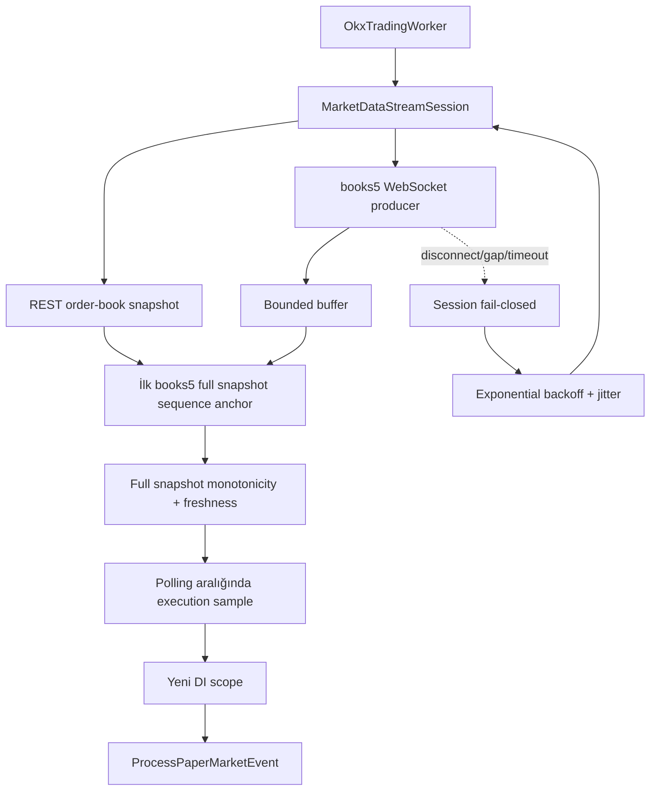

## 18. OKX Spot başlangıç ve readiness kapısı

```mermaid
flowchart TD
    CFG[TradingOptions: OKX/BASE-QUOTE] --> CAT[OKX public instruments REST]
    CAT --> VALID{SPOT + live + symbol eşleşmesi\npozitif tickSz/lotSz/minSz}
    VALID -- Hayır --> STOP[Host startup fail-fast\nEndpoint erişilemez]
    VALID -- Evet --> IR[Instrument ready]
    IR --> SIGNAL{15m / 200 signal warm-up\nexact + contiguous}
    SIGNAL -- Hayır --> STOP
    SIGNAL -- Evet --> TREND{1H / 200 trend warm-up\nexact + contiguous}
    TREND -- Hayır --> STOP
    TREND -- Evet --> CR[Dual candle history ready]
    CR --> WORKER[OkxTradingWorker başlar]
    WORKER --> WS[books5 WSS + REST recovery]
    WS --> EVENT{İlk doğrulanmış event}
    EVENT -- Hayır --> WAIT[Readiness 503]
    EVENT -- Evet --> READY[Readiness 200]
    READY --> PAPER[Paper execution sample]
    WS -. disconnect/gap/timeout .-> WAIT
```

Bu readiness instrument, kapalı candle geçmişi ve market-data kapılarını temsil eder. SQL Server erişimi ve startup reconciliation ayrı kontroller olarak eklenene kadar production-ready iddiası oluşturmaz.

## 19. Kapalı candle gap recovery

```mermaid
flowchart TD
    LAST[Son kabul edilen kapalı candle] --> EXPECT[Expected open = last close]
    STREAM[Yeni kapalı candle] --> CHECK{Open time expected mı?}
    CHECK -- Evet --> ACCEPT[Sequence accepted]
    CHECK -- Hayır, ileri --> PAUSE[Series not-ready]
    PAUSE --> RANGE[OKX history-candles\nbounded expected..observed close]
    RANGE --> VALID{Tam sayı + UTC boundary +\naynı instrument/timeframe + closed}
    VALID -- Hayır --> CLOSED[Hiçbir kısmi candle yayınlama]
    VALID -- Evet --> ATOMIC[Contiguous recovery atomik uygula]
    ATOMIC --> READY[Series ready]
```

## 20. Kapalı candle warm-up kapısı

```mermaid
flowchart TD
    NOW[Ortak KnownAt UTC] --> SIGNAL[15m / 200 signal range]
    SIGNAL --> SGUARD{Exact + closed + contiguous}
    SGUARD -- Hayır --> REJECT[Host startup fail-closed]
    SGUARD -- Evet --> TREND[1H / 200 trend range]
    TREND --> TGUARD{Exact + closed + contiguous}
    TGUARD -- Hayır --> REJECT
    TGUARD -- Evet --> CANDLE_READY[Signal + Trend CandleHistoryReady]
```

Her seri kendi timeframe sınırını aynı UTC `knownAt` değerinden hesaplar; devam eden açık candle hiçbir aralığa dahil edilmez. Instrument ve iki candle-history kapısı geçtikten sonra stream başlar; ilk doğrulanmış market event gelene kadar genel readiness yine kapalıdır.

## 21. İlk sürümlü strateji zarfı

```mermaid
flowchart LR
    S15[15m contiguous closed candles\nminimum 200] --> SYNC{Timeframe ve kapanış\nuyumlu mu?}
    T1H[1H contiguous closed candles\nminimum 200 + EMA200] --> SYNC
    DEF[btc-usdt-long-flat-baseline\nv1 / OKX:BTC-USDT] --> SYNC
    SYNC -- Açık/future/gap/identity mismatch --> HALT[Karar üretme]
    SYNC -- Geçerli --> EVAL[Deterministik strategy evaluation]
    EVAL --> HOLD[Hold]
    EVAL --> LONG[EnterLong]
    EVAL --> FLAT[ExitToFlat]
    LONG --> RISK[TradeIntent değil\nönce ayrı dönüşüm + Risk]
    FLAT --> RISK
```

Short action sözleşmede bulunmaz. Kesin entry/exit formülü backtest ve out-of-sample kanıtı kabul edilene kadar `EVAL` uygulaması execution'a bağlanmaz.

## 22. Canlı multi-timeframe candle ve gap recovery

```mermaid
flowchart TD
    WORKER[OkxCandleWorker] --> CLOSED[Signal + Trend readiness kapalı]
    CLOSED --> WS[OKX business WSS\ncandle15m + candle1H]
    WS --> BUFFER[Bounded candle buffer\ncapacity 64 / wait]
    CLOSED --> REST[Her timeframe için son kapalı REST anchor]
    REST --> GUARDS[15m ve 1H sequence guard]
    GUARDS --> READY[SessionReady\niki readiness açık]
    BUFFER --> PARSE{confirm=1 ve contract geçerli mi?}
    PARSE -- confirm=0 --> IGNORE[Açık candle'ı yayınlama]
    PARSE -- invalid --> RECONNECT[Readiness kapat + backoff/jitter]
    PARSE -- closed --> OBSERVE{Contiguous mi?}
    OBSERVE -- duplicate/old --> IGNORE
    OBSERVE -- next --> PIPE[Validated closed-candle pipeline]
    OBSERVE -- gap --> FILL[Bounded REST gap recovery]
    FILL -- complete --> PIPE
    FILL -- invalid/oversized --> RECONNECT
    WS -. close/heartbeat timeout .-> RECONNECT
    RECONNECT --> WS
```

Bu akış trade tick'lerinden yerel OHLCV üretmez; ilk sürümde borsanın aggregate candle kanalı anti-corruption adapter'ında normalize edilir. Strateji/economic intent bağlantısı ayrı bir sonraki dilimdir.

## 23. Bounded candle serisi ve deterministik EMA trend filtresi

```mermaid
flowchart TD
    START[Startup veya reconnect] --> WARM[15m + 1H tam warm-up\naynı UTC knownAt]
    WARM --> VALID{Exact, closed ve contiguous mı?}
    VALID -- Hayır --> CLOSED[Readiness kapalı\nkarar üretme]
    VALID -- Evet --> SEED[Timeframe başına bounded store\ncapacity 300]
    LIVE[Validated closed live candle] --> APPEND{Store append}
    SEED --> APPEND
    APPEND -- Duplicate / eski --> IGNORE[Seriyi ilerletme]
    APPEND -- Gap / conflict --> CLOSED
    APPEND -- Contiguous --> TRIM[Append + en eskiyi buda]
    TRIM --> SNAP[Immutable ready snapshot]
    SNAP --> LAST200[Son tam 200 adet 1H candle]
    LAST200 --> EMA[Decimal EMA200\nfirst close seed]
    EMA --> FILTER{Son close EMA üstünde mi?}
    FILTER -- Evet --> ALLOW[Long yönüne izin]
    FILTER -- Hayır --> HOLD[Long izni yok]
    ALLOW --> NOEXEC[Henüz execution'a bağlı değil]
    HOLD --> NOEXEC
```

Aynı son 200 candle penceresi aynı EMA sonucunu üretir. Aylık getiri hedefi ve risk limitleri bu hesaplamaya parametre olarak girmez.

## 24. Deterministik v1 karar replay'i

```mermaid
flowchart TD
    S[Async 15m closed candles] --> MERGE[Kapanış zamanına göre streaming merge]
    T[Async 1H closed candles] --> MERGE
    MERGE --> ORDER{Close time eşit mi?}
    ORDER -- Evet --> TFIRST[1H trend önce]
    ORDER -- Hayır --> KNOWN[Yalnız o anda bilinen candle]
    TFIRST --> WINDOWS[Bounded 200-candle windows]
    KNOWN --> WINDOWS
    WINDOWS --> VALID{Identity + contiguous + warm-up}
    VALID -- Hayır --> FAIL[Replay fail-closed]
    VALID -- Evet --> POS{Sanal state}
    POS -- Flat --> ENTRY[1H close > EMA200\n15m EMA20 cross-up\nbody <= 2%]
    POS -- Long --> EXIT[1H trend loss veya\n15m EMA20 cross-down]
    ENTRY --> DECISION[Versioned StrategyDecision]
    EXIT --> DECISION
    DECISION --> STATE[Flat/Long state update]
    STATE --> NOEXEC[Fill, PnL, intent veya order yok]
```

Gelecekteki trend candle enumerator tarafından görülse bile sinyal kapanışından önce pencereye alınmaz. Aynı veri sırası ve v1 tanımı aynı karar dizisini üretir.
