# Sistem Diyagramları

**Durum:** Taslak

## 1. Sistem bağlamı

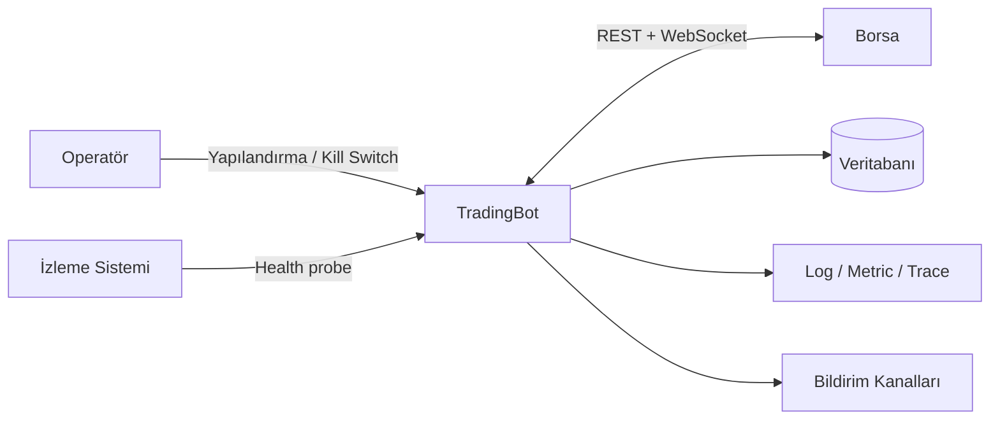

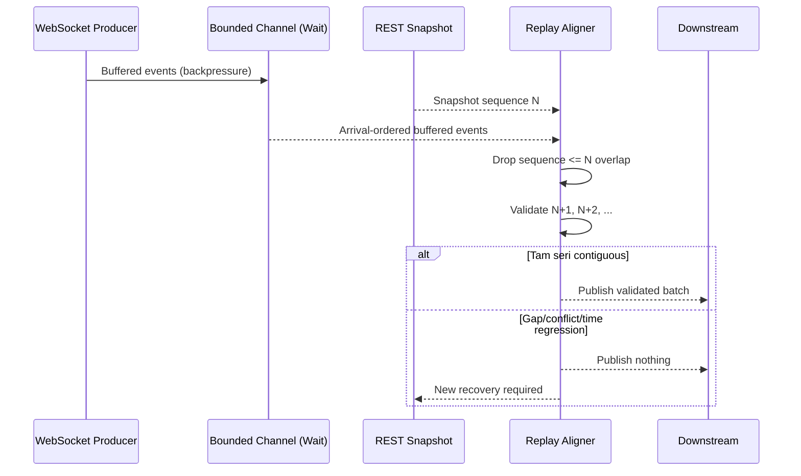

## 2. Container/bileşen görünümü

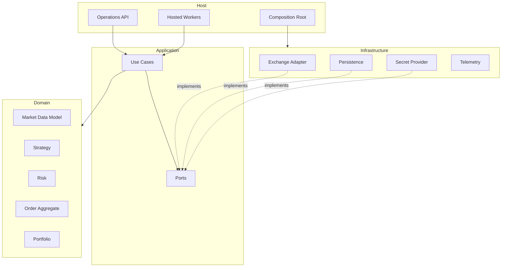

## 3. Market data akışı

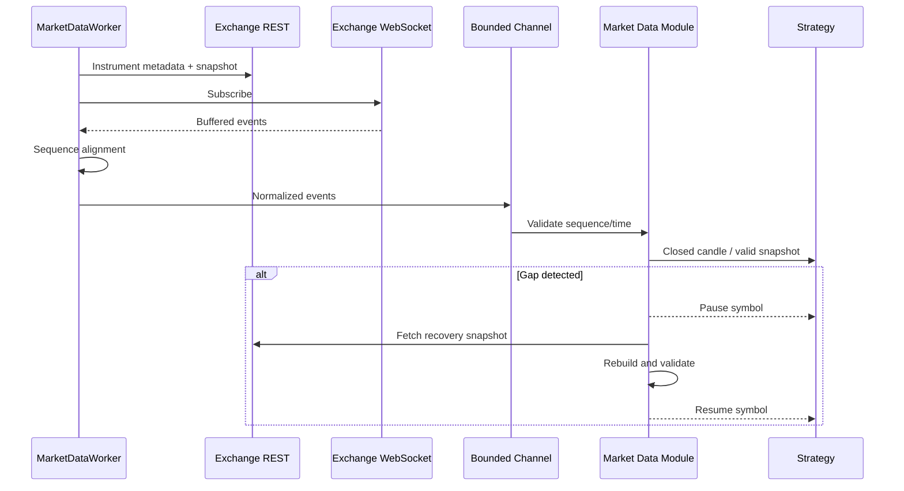

### Market-data integrity state machine

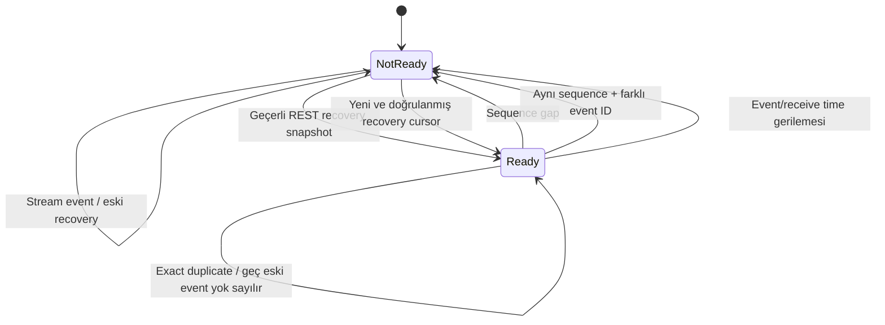

Guard son güvenilir cursor'u gap sırasında ilerletmez. Bu sayede recovery adapter'ı hangi sequence'den itibaren snapshot/replay gerektiğini kesin olarak bilir.

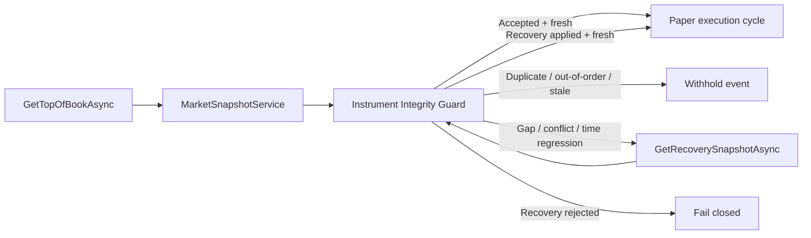

## 4. Emir yaşam döngüsü

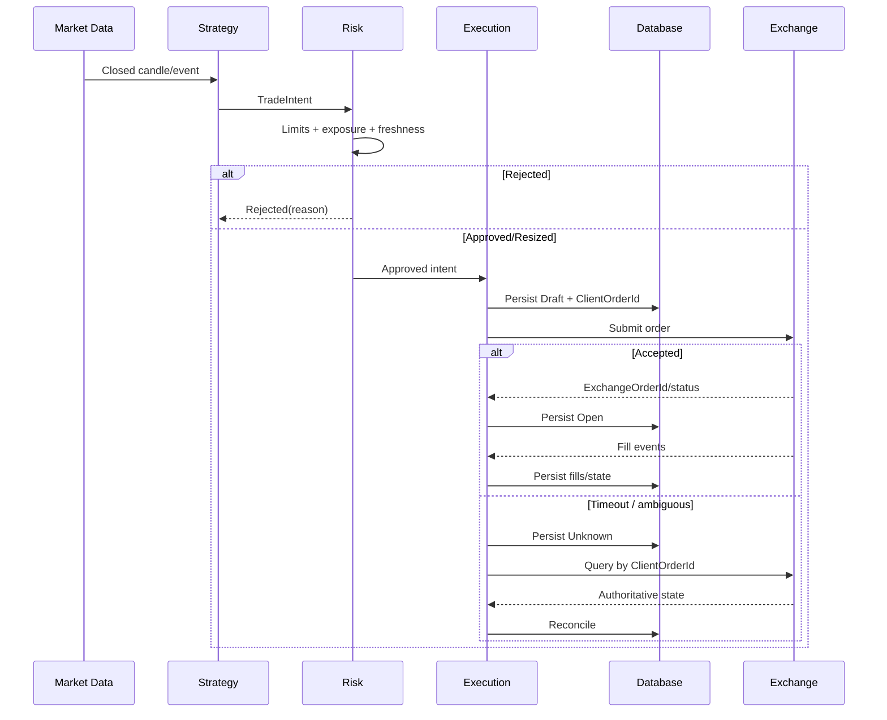

## 5. Deployment

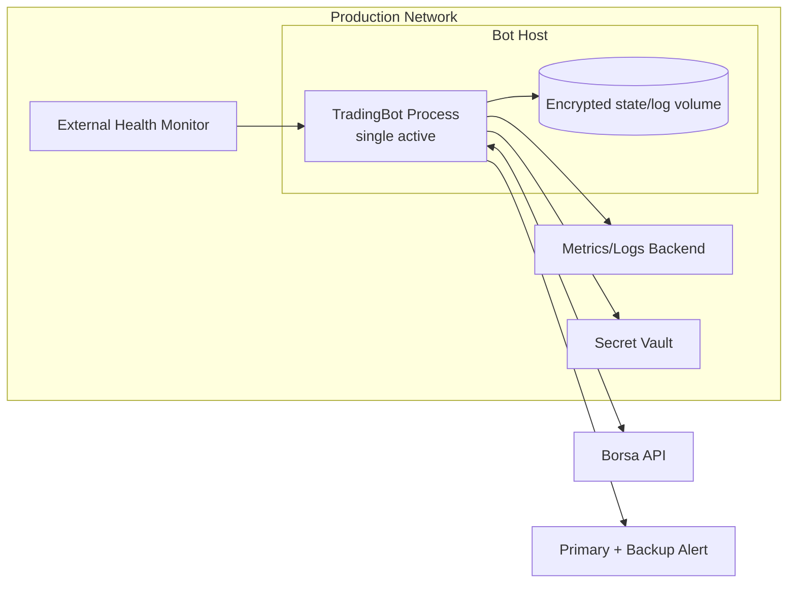

## 6. ACID ve dış borsa sınırı

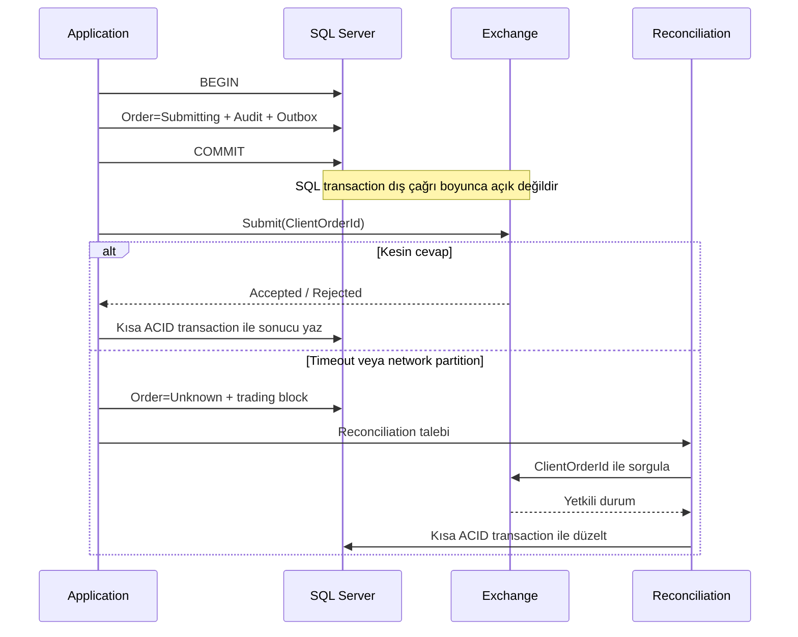

## 7. Tutarlılık bölgeleri

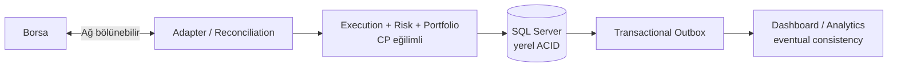

## 8. Bağımlılık yönü

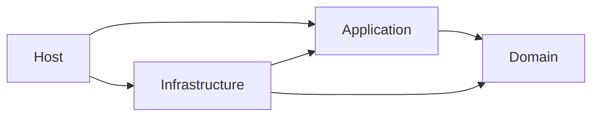

Okların hiçbiri dış katmandan içeri doğru ters çevrilemez; Domain bağımsız kalır.

## 9. Tam gerçekleşen Spot fill persistence akışı

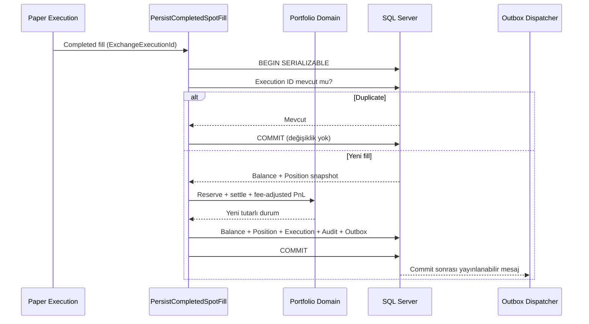

Bu kısa yol tamamen gerçekleşen paper fill içindir. Açık ve parçalı emirler aşağıdaki kalıcı rezervasyon yaşam döngüsünü kullanır.

## 10. Partial fill ve kalıcı rezervasyon yaşam döngüsü

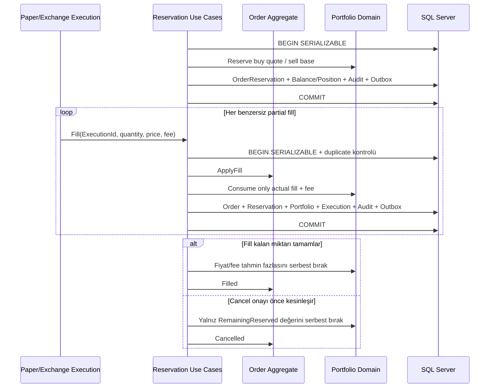

Serializable transaction ve `rowversion`, aynı order üzerindeki fill/cancel yarışında lost update'i engeller. Terminal reservation'a gelen geç olay bakiye veya PnL oluşturamaz.

## 11. Spot account reconciliation ve trading halt

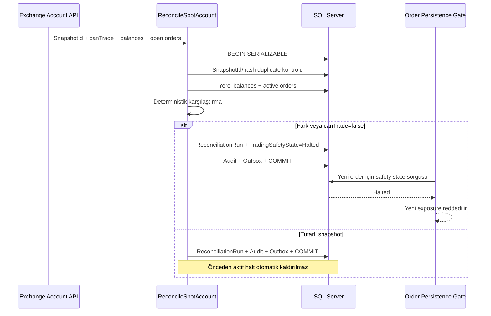

## 12. Kontrollü trading safety recovery

```mermaid
sequenceDiagram
    participant OP as Yetkili Operatör
    participant REC as Reconciliation
    participant SAFE as RecoverTradingSafety
    participant DB as SQL Server
    participant ORD as Order Persistence Gate

    REC->>DB: Clean snapshot #1 (halt sonrasında)
    REC->>DB: Clean snapshot #2 (halt sonrasında)
    OP->>SAFE: RecoveryId + OperatorId + Reason
    SAFE->>DB: BEGIN SERIALIZABLE
    SAFE->>DB: Halt state + son 2 run + duplicate RecoveryId
    alt Kanıt eksik veya snapshot kirli
        SAFE-->>OP: Recovery reddedildi
    else İki snapshot tutarlı ve canTrade=true
        SAFE->>DB: SafetyState=Ready + Recovery + Audit + Outbox
        SAFE->>DB: COMMIT
        ORD->>DB: Yeni risk onayının zamanı safety transition'dan sonra mı?
        alt Eski risk onayı
            ORD-->>ORD: Reddet; yeniden risk değerlendirmesi gerekli
        else Yeni risk onayı
            ORD->>DB: Atomik order persistence
        end
    end
```

## 13. Deterministik paper execution

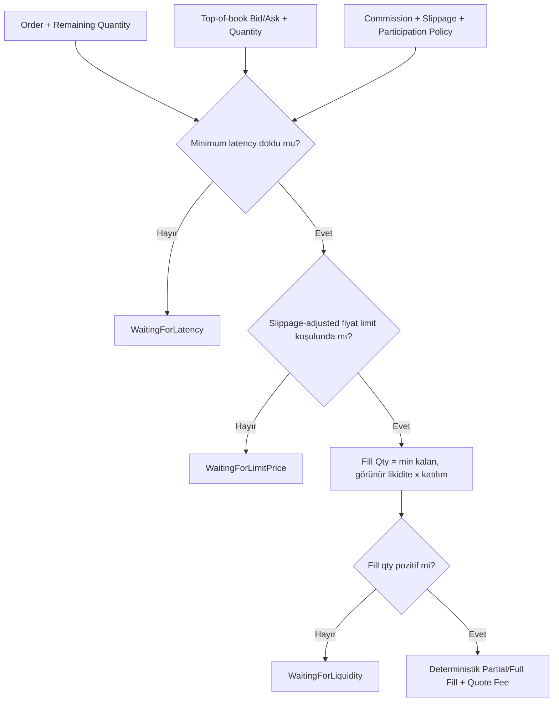

## 14. Uçtan uca paper fill persistence pipeline

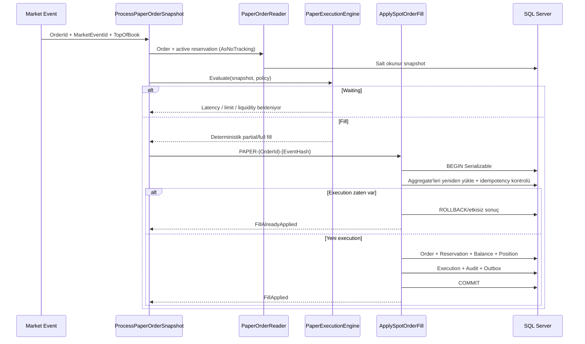

## 15. Hosted paper market-event döngüsü

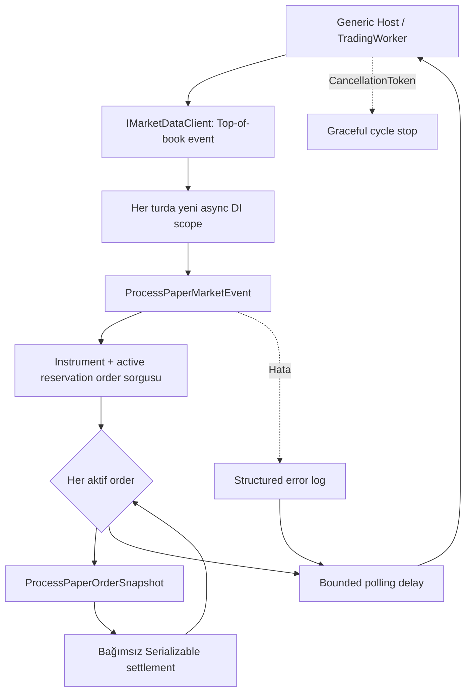

Worker singleton olsa da scoped persistence nesnesi taşımaz. Market event fan-out sıralıdır; bu ilk sürümde aynı order üzerinde paralel settlement yarışı üretilmez.

## 16. OKX public books5 WebSocket taşıması

```mermaid
sequenceDiagram
    participant C as OkxSpotMarketStreamClient
    participant WS as OKX WSS / books5
    participant P as Books5 Parser
    participant G as Integrity Guard

    C->>WS: TLS connect + subscribe(BASE-QUOTE)
    WS-->>C: Subscribe acknowledgement
    C-->>C: Control mesajı; yayınlama
    WS-->>C: Fragmented books5 snapshot
    C->>C: ArrayPool buffer + 64 KiB limit
    C->>P: Complete UTF-8 JSON
    P->>G: seqId + prevSeqId + event/receive time
    alt 20 saniye veri yok
        C->>WS: ping
        WS-->>C: pong
    end
    alt İkinci heartbeat timeout
        C-->>C: Connection failure; supervisor yeniden bağlar
    end
```

## 17. OKX hosted recovery ve reconnect supervisor

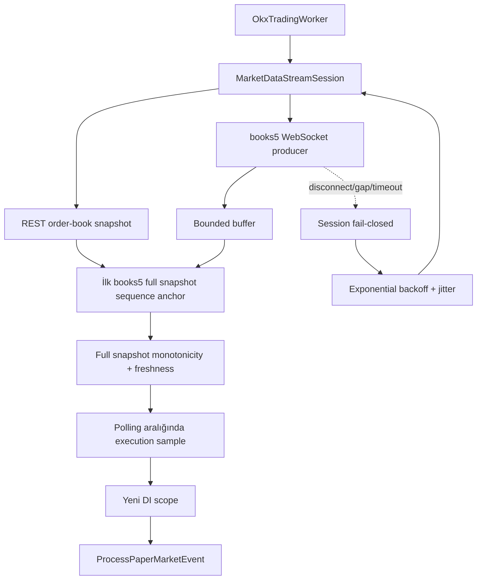

## 18. OKX Spot başlangıç ve readiness kapısı

```mermaid
flowchart TD
    CFG[TradingOptions: OKX/BASE-QUOTE] --> CAT[OKX public instruments REST]
    CAT --> VALID{SPOT + live + symbol eşleşmesi\npozitif tickSz/lotSz/minSz}
    VALID -- Hayır --> STOP[Host startup fail-fast\nEndpoint erişilemez]
    VALID -- Evet --> IR[Instrument ready]
    IR --> SIGNAL{15m / 200 signal warm-up\nexact + contiguous}
    SIGNAL -- Hayır --> STOP
    SIGNAL -- Evet --> TREND{1H / 200 trend warm-up\nexact + contiguous}
    TREND -- Hayır --> STOP
    TREND -- Evet --> CR[Dual candle history ready]
    CR --> WORKER[OkxTradingWorker başlar]
    WORKER --> WS[books5 WSS + REST recovery]
    WS --> EVENT{İlk doğrulanmış event}
    EVENT -- Hayır --> WAIT[Readiness 503]
    EVENT -- Evet --> READY[Readiness 200]
    READY --> PAPER[Paper execution sample]
    WS -. disconnect/gap/timeout .-> WAIT
```

Bu readiness instrument, kapalı candle geçmişi ve market-data kapılarını temsil eder. SQL Server erişimi ve startup reconciliation ayrı kontroller olarak eklenene kadar production-ready iddiası oluşturmaz.

## 19. Kapalı candle gap recovery

```mermaid
flowchart TD
    LAST[Son kabul edilen kapalı candle] --> EXPECT[Expected open = last close]
    STREAM[Yeni kapalı candle] --> CHECK{Open time expected mı?}
    CHECK -- Evet --> ACCEPT[Sequence accepted]
    CHECK -- Hayır, ileri --> PAUSE[Series not-ready]
    PAUSE --> RANGE[OKX history-candles\nbounded expected..observed close]
    RANGE --> VALID{Tam sayı + UTC boundary +\naynı instrument/timeframe + closed}
    VALID -- Hayır --> CLOSED[Hiçbir kısmi candle yayınlama]
    VALID -- Evet --> ATOMIC[Contiguous recovery atomik uygula]
    ATOMIC --> READY[Series ready]
```

## 20. Kapalı candle warm-up kapısı

```mermaid
flowchart TD
    NOW[Ortak KnownAt UTC] --> SIGNAL[15m / 200 signal range]
    SIGNAL --> SGUARD{Exact + closed + contiguous}
    SGUARD -- Hayır --> REJECT[Host startup fail-closed]
    SGUARD -- Evet --> TREND[1H / 200 trend range]
    TREND --> TGUARD{Exact + closed + contiguous}
    TGUARD -- Hayır --> REJECT
    TGUARD -- Evet --> CANDLE_READY[Signal + Trend CandleHistoryReady]
```

Her seri kendi timeframe sınırını aynı UTC `knownAt` değerinden hesaplar; devam eden açık candle hiçbir aralığa dahil edilmez. Instrument ve iki candle-history kapısı geçtikten sonra stream başlar; ilk doğrulanmış market event gelene kadar genel readiness yine kapalıdır.

## 21. İlk sürümlü strateji zarfı

```mermaid
flowchart LR
    S15[15m contiguous closed candles\nminimum 200] --> SYNC{Timeframe ve kapanış\nuyumlu mu?}
    T1H[1H contiguous closed candles\nminimum 200 + EMA200] --> SYNC
    DEF[btc-usdt-long-flat-baseline\nv1 / OKX:BTC-USDT] --> SYNC
    SYNC -- Açık/future/gap/identity mismatch --> HALT[Karar üretme]
    SYNC -- Geçerli --> EVAL[Deterministik strategy evaluation]
    EVAL --> HOLD[Hold]
    EVAL --> LONG[EnterLong]
    EVAL --> FLAT[ExitToFlat]
    LONG --> RISK[TradeIntent değil\nönce ayrı dönüşüm + Risk]
    FLAT --> RISK
```

Short action sözleşmede bulunmaz. Kesin entry/exit formülü backtest ve out-of-sample kanıtı kabul edilene kadar `EVAL` uygulaması execution'a bağlanmaz.

## 22. Canlı multi-timeframe candle ve gap recovery

```mermaid
flowchart TD
    WORKER[OkxCandleWorker] --> CLOSED[Signal + Trend readiness kapalı]
    CLOSED --> WS[OKX business WSS\ncandle15m + candle1H]
    WS --> BUFFER[Bounded candle buffer\ncapacity 64 / wait]
    CLOSED --> REST[Her timeframe için son kapalı REST anchor]
    REST --> GUARDS[15m ve 1H sequence guard]
    GUARDS --> READY[SessionReady\niki readiness açık]
    BUFFER --> PARSE{confirm=1 ve contract geçerli mi?}
    PARSE -- confirm=0 --> IGNORE[Açık candle'ı yayınlama]
    PARSE -- invalid --> RECONNECT[Readiness kapat + backoff/jitter]
    PARSE -- closed --> OBSERVE{Contiguous mi?}
    OBSERVE -- duplicate/old --> IGNORE
    OBSERVE -- next --> PIPE[Validated closed-candle pipeline]
    OBSERVE -- gap --> FILL[Bounded REST gap recovery]
    FILL -- complete --> PIPE
    FILL -- invalid/oversized --> RECONNECT
    WS -. close/heartbeat timeout .-> RECONNECT
    RECONNECT --> WS
```

Bu akış trade tick'lerinden yerel OHLCV üretmez; ilk sürümde borsanın aggregate candle kanalı anti-corruption adapter'ında normalize edilir. Strateji/economic intent bağlantısı ayrı bir sonraki dilimdir.

## 23. Bounded candle serisi ve deterministik EMA trend filtresi

```mermaid
flowchart TD
    START[Startup veya reconnect] --> WARM[15m + 1H tam warm-up\naynı UTC knownAt]
    WARM --> VALID{Exact, closed ve contiguous mı?}
    VALID -- Hayır --> CLOSED[Readiness kapalı\nkarar üretme]
    VALID -- Evet --> SEED[Timeframe başına bounded store\ncapacity 300]
    LIVE[Validated closed live candle] --> APPEND{Store append}
    SEED --> APPEND
    APPEND -- Duplicate / eski --> IGNORE[Seriyi ilerletme]
    APPEND -- Gap / conflict --> CLOSED
    APPEND -- Contiguous --> TRIM[Append + en eskiyi buda]
    TRIM --> SNAP[Immutable ready snapshot]
    SNAP --> LAST200[Son tam 200 adet 1H candle]
    LAST200 --> EMA[Decimal EMA200\nfirst close seed]
    EMA --> FILTER{Son close EMA üstünde mi?}
    FILTER -- Evet --> ALLOW[Long yönüne izin]
    FILTER -- Hayır --> HOLD[Long izni yok]
    ALLOW --> NOEXEC[Henüz execution'a bağlı değil]
    HOLD --> NOEXEC
```

Aynı son 200 candle penceresi aynı EMA sonucunu üretir. Aylık getiri hedefi ve risk limitleri bu hesaplamaya parametre olarak girmez.

## 24. Deterministik v1 karar replay'i

```mermaid
flowchart TD
    S[Async 15m closed candles] --> MERGE[Kapanış zamanına göre streaming merge]
    T[Async 1H closed candles] --> MERGE
    MERGE --> ORDER{Close time eşit mi?}
    ORDER -- Evet --> TFIRST[1H trend önce]
    ORDER -- Hayır --> KNOWN[Yalnız o anda bilinen candle]
    TFIRST --> WINDOWS[Bounded 200-candle windows]
    KNOWN --> WINDOWS
    WINDOWS --> VALID{Identity + contiguous + warm-up}
    VALID -- Hayır --> FAIL[Replay fail-closed]
    VALID -- Evet --> POS{Sanal state}
    POS -- Flat --> ENTRY[1H close > EMA200\n15m EMA20 cross-up\nbody <= 2%]
    POS -- Long --> EXIT[1H trend loss veya\n15m EMA20 cross-down]
    ENTRY --> DECISION[Versioned StrategyDecision]
    EXIT --> DECISION
    DECISION --> STATE[Flat/Long state update]
    STATE --> NOEXEC[Fill, PnL, intent veya order yok]
```

Gelecekteki trend candle enumerator tarafından görülse bile sinyal kapanışından önce pencereye alınmaz. Aynı veri sırası ve v1 tanımı aynı karar dizisini üretir.

## 25. Backtest execution ve performans raporu

```mermaid
flowchart TD
    D[StrategyDecision at closed 15m] --> TARGET[Long/Flat execution target]
    TARGET --> NEXT[Sonraki 15m candle open]
    PREV[Karar anında bilinen önceki candle volume] --> BOOK[Synthetic bid/ask\nmid ± half spread]
    NEXT --> BOOK
    BOOK --> LATENCY[Open + minimum latency]
    LATENCY --> PAPER[PaperExecutionEngine\nslippage + participation]
    PAPER -- Likidite yok/kısmi --> CARRY[Target sonraki candle'a taşınır]
    PAPER -- Fill --> FEE[İki taraflı quote fee]
    FEE --> CASH[Cash + SpotPosition\nno leverage / no short]
    CASH --> METRICS[Gross/net return, PnL, costs\ndrawdown, win rate, PF, expectancy]
    CARRY --> NEXT
    METRICS --> OPEN{Veri sonunda açık mı?}
    OPEN -- Evet --> MARK[Net-liquidation estimate\nopen qty + pending açık]
    OPEN -- Hayır --> REPORT[Final report]
    MARK --> REPORT
```

Mevcut candle'ın kapanışta bilinen hacmi kendi açılış fill'inde kullanılmaz. Model gerçek order-book queue replay'i değildir ve veri sonunda yapay kapanış üretmez.

## 26. Streaming dataset, split ve reproducible manifest

```mermaid
flowchart TD
    FILE[Canonical UTF-8 candle CSV] --> OPEN[Read-only single file handle]
    OPEN --> HASH[Streaming raw SHA-256\n64 KiB buffer]
    HASH --> REWIND[Seek to start]
    REWIND --> ROWS[Async line-by-line parse]
    ROWS --> VALID{Header + UTC + decimal +\nOHLCV + boundary + contiguous}
    VALID -- Hayır --> FAIL[Summary/manifest yok]
    VALID -- Evet --> SPLIT{UTC chronological split}
    SPLIT --> TRAIN[Train]
    SPLIT --> VAL[Validation]
    SPLIT --> OOS[Out-of-sample]
    PLAN1[Parameter selection] --> TRAIN
    PLAN1 --> VAL
    OOS -. yield yasak .-> PLAN1
    PLAN2[Final evaluation] --> OOS
    TRAIN --> EOF[Full EOF summary]
    VAL --> EOF
    OOS --> EOF
    EOF --> COVER{15m/1H aligned ve\nfull coverage mı?}
    COVER -- Hayır --> FAIL
    COVER -- Evet --> MANIFEST[Data hash + config hash +\nsplit/purpose/seed manifest hash]
```

OOS verisi parameter-selection stream'ine hiç verilmez. Aynı raw dosyalar, strategy/execution config, split ve seed aynı manifest kimliğini üretir.

## 27. Walk-forward pencere üretimi

```mermaid
flowchart LR
    CFG[UTC dataset + train/validation/OOS süreleri] --> MODE{Training modu}
    MODE -- Rolling --> R[Training başlangıcı ve bitişi<br/>OOS süresi kadar ilerler]
    MODE -- Expanding --> E[Training başlangıcı sabit<br/>bitişi OOS süresi kadar ilerler]
    R --> W1[Window 0<br/>Train → Validation → OOS 0]
    E --> W1
    W1 --> W2[Window 1<br/>Train → Validation → OOS 1]
    W2 --> W3[Window N<br/>Train → Validation → OOS N]
    W1 -. OOS 0 end .-> W2
    W2 -. OOS 1 end .-> W3
    ALIGN[15m ve 1H hizalama] --> W1
    LIMIT[En fazla 10.000 pencere] --> W1
```

Her pencerenin parameter-selection çalışması yalnız train/validation görür. O pencerenin OOS aralığı ayrı final evaluation'da açılır; ardışık OOS aralıkları birbirine bitişik ve çakışmasızdır.

## 28. Walk-forward kimlik, rapor ve SQL persistence

```mermaid
flowchart TD
    S[WalkForwardSchedule] --> SH[Schedule SHA-256]
    M0[Window 0 final-OOS manifest] --> RH[Run SHA-256]
    MN[Window N final-OOS manifest] --> RH
    SH --> RH
    R0[Window 0 execution report] --> VALID{Split/index/OOS ve<br/>finansal ilişkiler geçerli mi?}
    RN[Window N execution report] --> VALID
    VALID -- Hayır --> FAIL[Fail closed]
    VALID -- Evet --> AGG[Mean / median / worst / best<br/>compound / drawdown / trade / fee]
    RH --> PH[Report SHA-256]
    AGG --> PH
    PH --> IDEM{Run daha önce var mı?}
    IDEM -- Aynı report --> SAME[AlreadyStored]
    IDEM -- Farklı report --> CONFLICT[Determinism ihlali]
    IDEM -- Yok --> TX[Serializable SQL transaction]
    TX --> RUN[(research.WalkForwardRuns)]
    TX --> WINDOWS[(research.WalkForwardWindowResults)]
```

`ScheduleSha256` zaman politikasını, `RunSha256` girdileri ve `ReportSha256` sonuçları tanımlar. Compound return bağımsız OOS getirilerinin varsayımsal birleşimidir; gerçek sermaye devamlılığı veya getiri garantisi değildir.

## 29. Streaming walk-forward OOS orkestrasyonu

```mermaid
flowchart TD
    S[WalkForwardSchedule] --> W{Sıradaki pencere}
    W --> FS[Taze signal dataset]
    W --> FT[Taze trend dataset]
    FS --> BW[Window filtresi]
    FT --> BW
    BW --> HIST[Train + validation<br/>bounded indicator warm-up]
    HIST --> GATE[ValidationEndExclusive<br/>position = Flat]
    GATE --> OOS[OOS strategy kararları]
    OOS --> EXEC[Next-open execution simulator]
    EXEC --> EOF[İki raw stream EOF'ye kadar tüketilir]
    EOF --> MAN[Final-OOS manifest + window result]
    MAN --> MORE{Pencere kaldı mı?}
    MORE -- Evet --> W
    MORE -- Hayır --> REPORT[Deterministik birleşik report]
    HIST -. ekonomik state taşınmaz .-> GATE
    BW -. OOS sonrası candle yield edilmez .-> EOF
    FAIL[Warm-up eksik / OOS değerlendirmesi yok / stream hatası] --> NONE[Kısmi rapor yok]
```

Train ve validation geçmişi yalnız indikatörleri ısıtır. OOS state'i `Flat` başlar; buna karşılık raw dosya hash/count/range kanıtı için her dataset tam olarak EOF'ye kadar okunur.

## 30. Atomik tarihsel dataset export

```mermaid
flowchart TD
    R[UTC ve timeframe-hizalı export aralığı] --> P[100 candle'lık sayfalar]
    P --> WAIT[Sayfa başlangıçları arası en az 100 ms]
    WAIT --> OKX[OKX history-candles]
    OKX --> VALID{Exact count + identity + contiguous?}
    VALID -- Hayır --> FAIL[Fail closed]
    VALID -- Evet --> TMP[64 KiB async partial CSV<br/>UTF-8 no BOM + LF + invariant decimal]
    TMP --> MORE{Sayfa kaldı mı?}
    MORE -- Evet --> WAIT
    MORE -- Hayır --> FLUSH[Flush + streaming SHA-256]
    FLUSH --> EXISTS{Hedef mevcut mu?}
    EXISTS -- Evet --> FAIL
    EXISTS -- Hayır --> MOVE[Overwrite olmadan atomik rename]
    MOVE --> ART[Descriptor + summary artifact]
    FAIL --> CLEAN[Yalnız bu run partial dosyası temizlenir]
```

Hiçbir aşamada tüm dataset RAM'e alınmaz. Final `.csv`, ancak bütün istek aralığı doğrulanıp diske yazıldıktan ve raw SHA-256 hesaplandıktan sonra görünür olur.

## 31. OOS buy-and-hold benchmark

```mermaid
flowchart TD
    W[Walk-forward OOS window] --> S[Bağımsız signal dataset stream]
    S --> V{UTC timeframe, başlangıç, bitiş ve contiguity geçerli mi?}
    V -- Hayır --> F[Fail closed; rapor yok]
    V -- Evet --> B[İlk OOS open: quote allocation ile buy]
    B --> C[Her close: maliyetli liquidation equity ve drawdown]
    C --> E[Son OOS close: raporlama amaçlı sell]
    E --> M[Net/gross return + fee/spread/slippage]
    M --> X[Strategy net return - benchmark net return]
    X --> H[walk-forward-report-v2 SHA-256]
    H --> SQL[(research WalkForwardRuns + WindowResults)]
```

Benchmark ve strateji aynı başlangıç sermayesi, allocation ve execution maliyet politikasını kullanır. Benchmark strateji kararı üretmez ve risk limitlerini değiştirmez.

## 32. Gerçek CSV walk-forward research CLI

```mermaid
flowchart LR
    CLI[run-walk-forward<br/>strict args] --> CFG[Versioned BTC-USDT v1 strategy<br/>explicit fixed execution policy]
    S[(Canonical 15m CSV)] --> F[Fresh streaming dataset factory]
    T[(Canonical 1H CSV)] --> F
    CFG --> O[Walk-forward orchestrator]
    F --> O
    O --> W[Independent OOS windows]
    W --> E[Strategy execution]
    W --> B[Cost-aware buy-and-hold]
    E --> R[walk-forward-report-v2 JSON]
    B --> R
    R --> H[Schedule / run / report SHA-256]
```

CLI dosyaları belleğe toplamaz ve sonuçları değiştirecek gizli varsayım almaz. Dataset path/source, UTC range, pencere süreleri, training modu ve random seed komut satırında açıkça verilir.

## 33. Cost-derived EMA hysteresis v2 kapısı

```mermaid
flowchart TD
    COST[20 bps fee + 20 bps spread + 20 bps slippage] --> HALF[Simetrik yarı bant: 30 bps]
    EMA[15m EMA20] --> UP[Upper = EMA × 1.003]
    EMA --> DOWN[Lower = EMA × 0.997]
    HALF --> UP
    HALF --> DOWN
    FLAT[Flat] --> CROSSUP{Close upper bandı<br/>yukarı kesti mi?}
    CROSSUP -- Evet + trend/FOMO geçer --> LONG[EnterLong]
    LONG --> CROSSDOWN{Close lower bandı<br/>aşağı kesti mi?}
    CROSSDOWN -- Evet --> EXIT[ExitToFlat]
    LONG --> TREND{1H trend filtresi kayıp mı?}
    TREND -- Evet --> EXIT
    V1[2025 kilitli v1 OOS] -. parameter selection yasak .-> FAIL[Fail closed]
    VALID[Önceden tanımlı train/validation kabul kapısı] --> NEWOOS{Tüm ölçütler geçti mi?}
    NEWOOS -- Hayır --> FAIL
    NEWOOS -- Evet --> LOCK[Yeni, görülmemiş OOS açılır]
```

v2 bandı piyasa sonucundan değil kabul edilmiş execution maliyetinden türetilir. Kodun varlığı validation veya canlılık onayı değildir.

## 34. v1-v2 validation-only karşılaştırma

```mermaid
flowchart TD
    CSV[Development 15m/1H canonical CSV] --> W[Rolling train/validation schedule]
    W --> V1[v1: train warm-up<br/>validation execution]
    W --> V2[v2: train warm-up<br/>validation execution]
    W --> B[Validation buy-and-hold benchmark]
    LOCK[OOS partition] -. strategy stream'ine verilmez .-> DENY[Fail closed]
    V1 --> COMP[Trade + fee/spread/slippage karşılaştırması]
    V2 --> COMP
    B --> COMP
    COMP --> GATE{Trade/cost ≥ %30 azaldı mı?<br/>Net > 0, excess ≥ 0,<br/>DD ≤ %5, kârlı pencere ≥ %60 mı?}
    GATE -- Hayır --> REJECT[Exit 3 / candidate rejected]
    GATE -- Evet --> ACCEPT[Exit 0 / yeni OOS açma izni]
    ACCEPT -. canlılık izni değildir .-> PAPER[Paper/testnet ayrı kapı]
```

Her sürüm taze streaming dataset instance'ları ve aynı execution policy ile çalışır. Run/report SHA-256, iki manifest setini ve sonuçları bağlar.

## 35. Instrument-quantized backtest execution

```mermaid
flowchart TD
    P[Execution policy] --> R{InstrumentRules var mı?}
    R -- Hayır --> L[Legacy execution ve legacy config hash]
    R -- Evet --> ID{Strategy instrument ile eşleşiyor mu?}
    ID -- Hayır --> F[Fail closed]
    ID -- Evet --> SIDE{Order side}
    SIDE -- Buy --> UP[Ask/slipped price: tick'e yukarı]
    SIDE -- Sell --> DOWN[Bid/slipped price: tick'e aşağı]
    UP --> Q[Quantity: lot step'e aşağı]
    DOWN --> Q
    Q --> MIN{Min quantity ve notional geçiyor mu?}
    MIN -- Entry hayır --> REJECT[Fill yok; entry target kapanır]
    MIN -- Exit hayır --> PENDING[Pozisyon açık; exit pending]
    MIN -- Evet --> E[Paper execution + quantized partial fill]
    E --> B[Strategy ve buy-and-hold aynı kurallar]
    B --> H[instrument-quantized-backtest-v1 config SHA-256]
```

Dört instrument değeri manifest kimliğine birlikte girer. Kuralsız akış yalnız kilitli legacy kanıtların tekrar üretimi içindir; yeni quantized çalışma order-book queue simülasyonu sayılmaz.

## 36. Bounded cumulative depth paper execution

```mermaid
flowchart TD
    WS[OKX books5 WebSocket] --> PARSE[1–5 bid + 1–5 ask parse]
    REST[OKX REST books sz=5] --> PARSE
    PARSE --> VALID{Pozitif, strict sıralı,<br/>top-level eş ve uncrossed mı?}
    VALID -- Hayır --> FAIL[Fail closed]
    VALID -- Evet --> SNAP[Immutable bounded depth snapshot]
    SNAP --> SIDE{Buy / Sell}
    SIDE --> LEVELS[En iyi fiyattan dış seviyelere ilerle]
    LEVELS --> PART[Her seviyede visible qty × participation]
    PART --> SLIP[Yönsel aleyhte slippage]
    SLIP --> LIMIT{Limit koşulu geçiyor mu?}
    LIMIT -- Hayır --> STOP[Sonraki seviyeleri tüketme]
    LIMIT -- Evet --> ACC[Quantity + notional biriktir]
    ACC --> VWAP[Fill price = cumulative VWAP]
    VWAP --> FEE[Fee = cumulative notional × rate]
```

Depth bulunmayan snapshot eski top-of-book yolunu kullanır. Bu akış aggregated görünür depth market impact modelidir; exchange queue sırası veya hidden liquidity replay'i değildir.

## 37. Deterministik işlem kaybı attribution

```mermaid
flowchart TD
    CSV[Development train/validation CSV] --> D[Deterministik strategy decisions]
    D --> X[Next-open execution simulator]
    X --> OPEN{Pozisyon açık mı?}
    OPEN -- Evet --> E[Kapalı mum high/low ile MFE/MAE]
    OPEN -- Hayır --> SKIP[Excursion yok]
    X --> F[Fill fee + spread + slippage]
    X --> R[Entry/exit reason code]
    E --> T[Completed trade attribution]
    F --> T
    R --> T
    T --> LIMIT{Trade sayısı bounded mı?}
    LIMIT -- Hayır --> FAIL[Fail closed; rapor yok]
    LIMIT -- Evet --> H[Diagnostics SHA-256]
    H --> A[Exit-reason aggregate report]
    OOS[Locked OOS] -. stream'e verilmez .-> FAIL
```

Çıkış next-open fill ile tamamlandıktan sonra aynı mumun high/low değeri excursion hesabına girmez. Diagnostics raporu mevcut execution report/hash sözleşmesinden ayrıdır ve canlı işlem izni vermez.

## 38. v3 cooldown ve trailing profit-protection validation

```mermaid
flowchart TD
    CLOSE[Kapalı 15m candle close] --> POS{Pozisyon}
    POS -- Flat --> CROSS{30 bps upper-band cross?}
    CROSS -- Hayır --> HOLD[Hold]
    CROSS -- Evet --> COOL{Exit sonrası 4 candle tamam mı?}
    COOL -- Hayır --> BLOCK[reentry-cooldown-blocked]
    COOL -- Evet --> ENTER[EnterLong; entry close kilitle]
    POS -- Long --> TREND{1H trend izinli mi?}
    TREND -- Hayır --> EXIT1[trend-filter-exit]
    TREND -- Evet --> PEAK[Peak close güncelle]
    PEAK --> ACTIVE{Peak entry'den 100 bps yukarıda mı?}
    ACTIVE -- Evet --> TRAIL{Close peak'ten 50 bps aşağıda mı?}
    TRAIL -- Evet --> EXIT2[profit-protection-exit]
    TRAIL -- Hayır --> LOWER{Lower-band cross?}
    ACTIVE -- Hayır --> LOWER
    LOWER -- Evet --> EXIT3[signal hysteresis exit]
    LOWER -- Hayır --> HOLD
    V2[v2 diagnostics] --> GATE[Ön kayıtlı 7 validation kapısı]
    EXIT1 --> V3[v3 diagnostics]
    EXIT2 --> V3
    EXIT3 --> V3
    V3 --> GATE
    GATE -- Herhangi biri başarısız --> REJECT[Exit 3; v3 rejected]
    OOS[Locked OOS] -. strategy stream'ine verilmez .-> REJECT
```

State yalnız entry reference, peak close ve bounded cooldown sayacıdır. High/low veya gelecek candle kullanılmaz. 2023 validation'da v3 trade/maliyeti artırdığı için reddedilmiş ve OOS açılmamıştır.

## 39. v4 ADX trend-kalite tasarımı

```mermaid
flowchart TD
    H[(Bounded closed 1H OHLC)] --> ADX[Wilder ADX 14<br/>checked decimal]
    H --> EMA[1H close > EMA200]
    S[Closed 15m candle] --> CROSS[EMA20 30 bps upper cross]
    CROSS --> FOMO[Body move <= %2]
    EMA --> ENTRY{Flat entry gate}
    ADX --> ENTRY
    FOMO --> ENTRY
    ENTRY -- ADX < 25 --> BLOCK[trend-strength-blocked]
    ENTRY -- Tümü geçer --> LONG[EnterLong]
    LONG --> EXIT[Mevcut v2 exit:<br/>trend loss veya lower cross]
    ADX -. long exit'i etkilemez .-> EXIT
    V2[v2 diagnostics] --> GATE[Ön kayıtlı 8 validation kapısı]
    LONG --> V4[v4 diagnostics]
    V4 --> GATE
    DEV[(2022 train/validation)] --> GATE
    HOLDOUT[2022 holdout] -. açılmaz .-> DENY[Fail closed]
    FUTURE[2026-07-27 sonrası forward OOS] -. validation geçmeden bekler .-> DENY
```

ADX yön değil trend gücü ölçer; yön EMA200 filtresinden gelir. v4, v3 state/cooldown/trailing davranışını taşımaz ve henüz uygulanmış ya da veri üzerinde denenmiş değildir.
