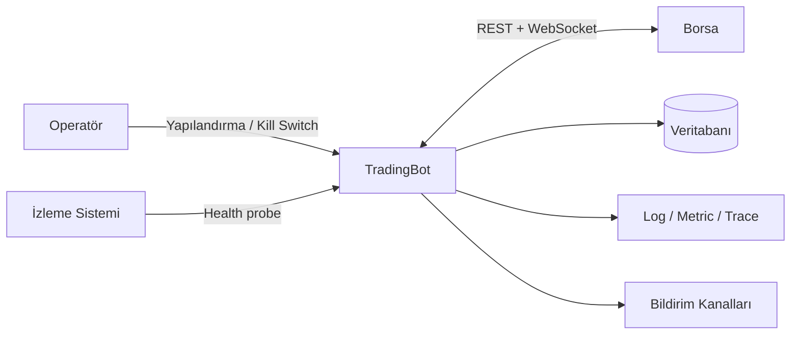
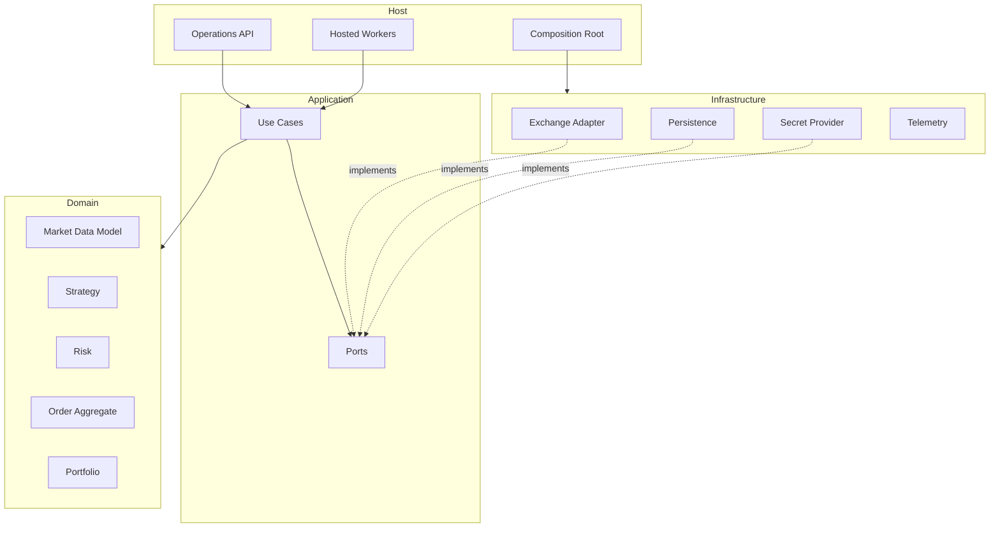
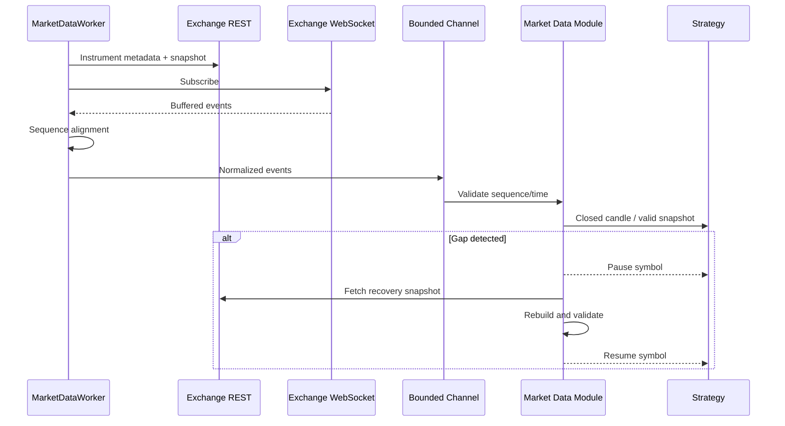
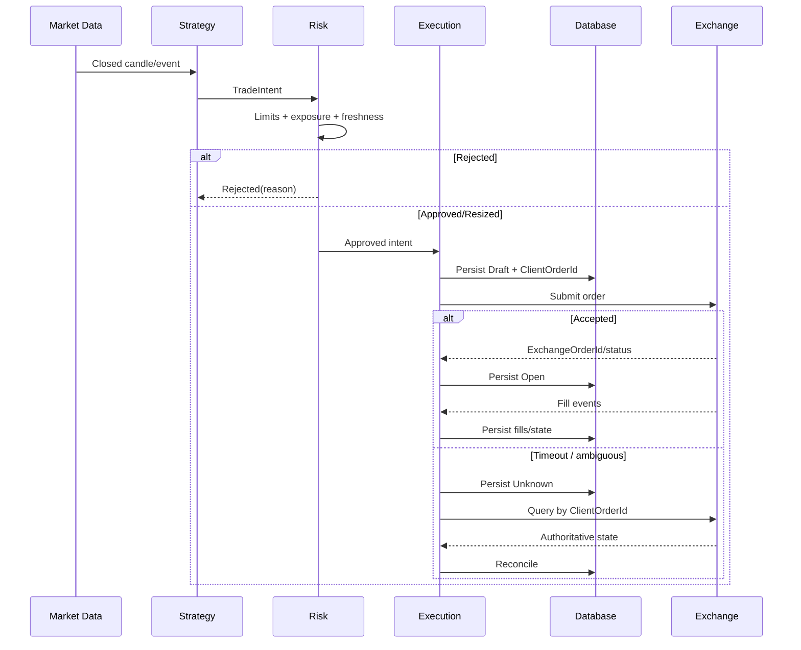
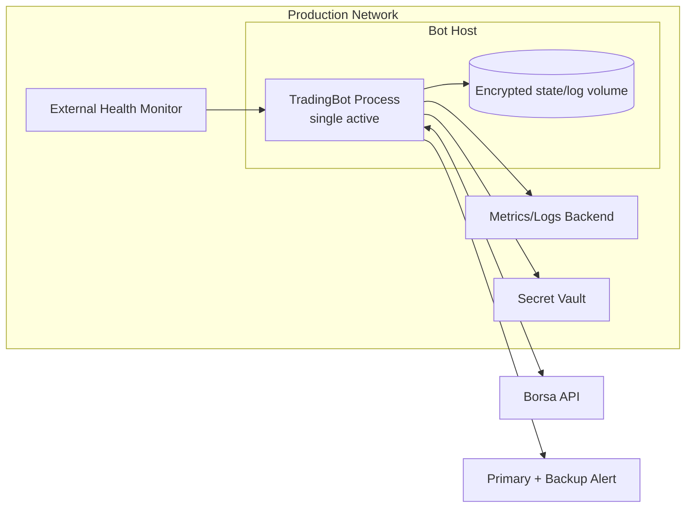
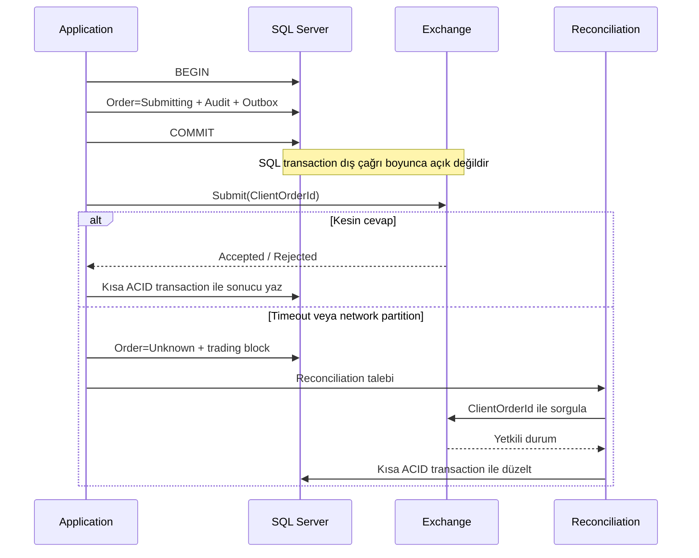
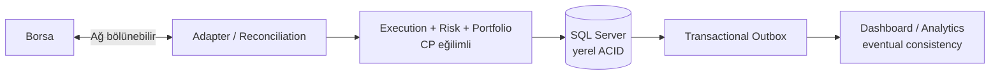
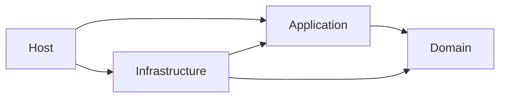

# Sistem Diyagramları

**Durum:** Taslak

## 1. Sistem bağlamı

## 2. Container/bileşen görünümü

## 3. Market data akışı

## 4. Emir yaşam döngüsü

## 5. Deployment

## 6. ACID ve dış borsa sınırı

## 7. Tutarlılık bölgeleri

## 8. Bağımlılık yönü

Okların hiçbiri dış katmandan içeri doğru ters çevrilemez; Domain bağımsız kalır.
