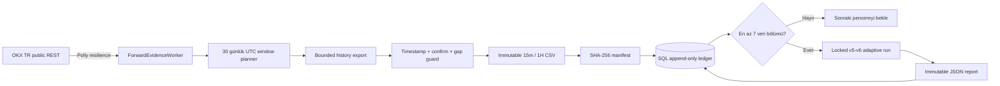

# Forward Evidence Pipeline

Durum: Kabul edildi

Tarih: 2026-07-27

## Amaç

Bu pipeline gerçek para veya private API anahtarı kullanmadan, `2026-07-28T00:00:00Z`
sonrasında oluşan BTC-USDT `15m/1H` kapalı mumlarını değiştirilemez araştırma
kanıtına dönüştürür. v6 strateji parametreleri, dokuz adaylı ATR grid'i, dinamik
execution policy ve sekiz acceptance kapısı PR #39 ile kilitlenen değerlerden
üretilir; runtime configuration bu değerleri değiştiremez.

## Akış

Bir değerlendirme için 30 günlük expanding train, 30 günlük validation ve en az
beş kesişmeyen 30 günlük OOS gerekir. Bu nedenle ilk acceptance koşusu için beş
değil, toplam yedi mühürlü veri bölümü gereklidir. İlk altı bölüm yalnız veri
kanıtı olarak saklanır; yedinci ve sonraki her bölüm yeni bir forward değerlendirme
üretir.

## Veri bütünlüğü

- Worker her çevrimde en fazla bir eksik pencereyi tamamlar; restart sonrası SQL
  ledger'dan kaldığı yere devam eder.
- Her pencere OKX `history-candles` endpoint'inden en fazla 100 mumluk sayfalarla
  yeniden kurulur. Eksik sayfa, açık mum (`confirm != 1`), yanlış timestamp veya
  timeframe gap'i publish işlemini durdurur.
- `15m` dosyası tam olarak `2880`, `1H` dosyası `720` mum içermelidir.
- İki CSV ve manifest geçici dizinde tamamlanır, sonra tek directory rename ile
  yayınlanır ve read-only işaretlenir.
- CSV, manifest ve değerlendirme raporu ayrı SHA-256 değerleriyle SQL'e yazılır.
- Aynı window/run kimliğinde farklı hash görülürse işlem fail-closed olur.

## SQL append-only sınırı

`research.ForwardEvidenceArtifacts` ve `research.ForwardEvidenceEvaluations`
tablolarında yalnız insert portu vardır. Unique hash/index kısıtlarına ek olarak
SQL trigger'ları `UPDATE` ve `DELETE` işlemlerini reddeder. Düzeltme geçmiş kaydı
değiştirmekle değil, yeni pipeline kimliği ve yeni kayıtla yapılır.

## Operasyon

`ForwardEvidence` configuration yalnız toplama takvimi, storage root, polling ve
OKX public metadata'da bulunmayan minimum-notional snapshot'ını taşır. Strateji,
grid ve acceptance değerleri configuration'a açılmaz. Worker tüm async işlemlerde
`CancellationToken` taşır; HTTP retry/circuit-breaker/timeout zinciri
`Microsoft.Extensions.Http.Resilience` üzerinden Polly ile sağlanır.

Resmî sözleşmeler:

- [OKX TR API V5](https://tr.okx.com/docs-v5/)
- [.NET HTTP resilience](https://learn.microsoft.com/dotnet/core/resilience/http-resilience)

Bu altyapının çalışması kârlılık kanıtı değildir. Acceptance sonucu yalnız gerekli
taze pencereler tamamlandıktan sonra üretilebilir.
