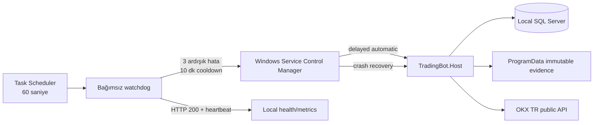

# Windows Service ve Bağımsız Watchdog

Durum: Kabul edildi

Tarih: 2026-07-27

Bu paket yalnız yerel Windows, `Paper` modu ve public OKX akışı içindir. Canlı
işlem izni veya v6 acceptance değişikliği üretmez.

## Çalışma modeli



SCM ilk, ikinci ve sonraki process çökmelerinde sırasıyla 60, 300 ve 900 saniye
sonra servisi yeniden başlatır. Watchdog ayrı bir `SYSTEM` scheduled task olarak
her 60 saniyede bir çalışır. `/health`, `/health/forward-evidence` ve
`/metrics/forward-evidence` yanıtlarını bounded timeout ile denetler. Evidence
heartbeat'i beş dakikadan eskiyse hata sayar. Üç ardışık hatadan sonra yalnız bir
idempotent service restart uygular ve on dakika boyunca yeni restart yapmaz.
`/health/ready` borsa bağımlılığı nedeniyle restart tetikleyicisi değildir;
readiness kaybında worker'ın kendi reconnect/backoff politikası çalışır.

## Kurulum

Yükseltilmiş PowerShell açılır. Bağlantı dizesi komut satırına veya repository'ye
yazılmadan yalnız process environment'ına verilir:

```powershell
$env:TRADINGBOT_SERVICE_DB_CONNECTION = '<TradingBotDb integrated-security connection string>'
powershell.exe -NoProfile -ExecutionPolicy Bypass `
  -File .\scripts\deploy-windows-service.ps1
Remove-Item Env:TRADINGBOT_SERVICE_DB_CONNECTION
```

Script şu işlemleri fail-closed ve tekrar çalıştırılabilir biçimde yapar:

- Host'u `%ProgramData%\TradingBot\releases\<UTC sürüm>` altına immutable publish eder.
- Benzersiz `TradingBot` service adını ve `127.0.0.1:5080` port sahipliğini doğrular.
- Servisi delayed automatic ve SCM recovery politikasıyla kaydeder.
- Servisi `NT SERVICE\TradingBot` sanal hesabıyla ve sınırlı dosya/SQL yetkileriyle çalıştırır.
- SQL/TCP service dependency, Event Log source ve evidence ACL'lerini kurar.
- `TradingBot-Watchdog` scheduled task'ını `SYSTEM` hesabıyla kaydeder.

## CLI matrisi

| İşlem | Komut |
|---|---|
| Durum | `Get-Service TradingBot` |
| SCM yapılandırması | `sc.exe qc TradingBot` |
| Recovery politikası | `sc.exe qfailure TradingBot` |
| Watchdog görevi | `Get-ScheduledTask TradingBot-Watchdog` |
| Liveness | `Invoke-WebRequest http://127.0.0.1:5080/health` |
| Evidence health | `Invoke-WebRequest http://127.0.0.1:5080/health/forward-evidence` |
| Metrics | `Invoke-WebRequest http://127.0.0.1:5080/metrics/forward-evidence` |
| Tek watchdog provası | `powershell.exe -File scripts/tradingbot-watchdog.ps1 -ProbeOnly` |
| Güvenli kayıt kaldırma | `powershell.exe -File scripts/remove-windows-service.ps1` |

Kaldırma script'i service ve scheduled-task kayıtlarını siler; evidence, watchdog
state ve immutable release dizinlerini özellikle korur.

## Single-instance katmanları

1. SCM aynı service adının ikinci kez oluşturulmasını reddeder.
2. Deployment script'i mevcut service binary kökünü ve port sahibini doğrular.
3. Host `Global\\TradingBot.Host.<ServiceName>` adlı Windows kernel nesnesine
   sahip olur; aynı kimlikle ikinci process fail-fast olur.
4. Forward writer ayrıca evidence root `.writer.lock` lease'ini korur.

Bu katmanlar distributed leader election değildir. Yerel makinede tek active
instance sözleşmesini güçlendirir.

## Güvenli güncelleme sınırı

Mevcut service durdurulmadan önce `/health` yanıtının `Paper` olduğu kanıtlanır.
Kanıt alınamazsa deployment durur. Live deployment ve açık pozisyon güncellemesi
bu scriptin kapsamı dışındadır. Sürümler yerinde ezilmez; yeni release dizini
oluşturulur ve SCM binary path'i atomik olarak yeni sürüme çevrilir.
